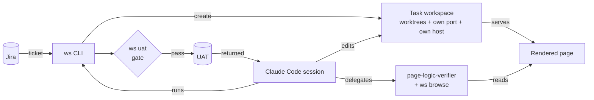

# Claude Code team setup: parallel tasks, page verification and a UAT gate

How we run Claude Code as the daily development tool for a multi-repo web product. Adapt it, do not install it.
Explanations are in `docs/`, templates in `templates/`.

Türkçe: [tr/README.md](tr/README.md)

## Context

Four repos under one root:

```
project/
├── legacy/   in-house PHP MVC framework (multi-host)
├── api/      PHP REST API (FastRoute + Eloquent)
├── web/      Next.js frontend (App Router, 7 locales)
└── cms/      headless WordPress (content source)
```

Work arrives as Jira tickets. Finished tickets go to a QA tester for UAT and come back if something is wrong.

## At a glance



## Problems and answers

| Problem | Answer | Doc |
|---|---|---|
| Several tickets open at once: branch switching, server restarts, mixed-up changes | A worktree, port and hostname per ticket, from one command | [02](docs/02-task-workspaces.md) |
| About a third of UAT hand-overs came back, mostly for preventable reasons | A checklist from the ticket, a logical check of the rendered page instead of unit tests, a mandatory UAT gate | [05](docs/05-verification-and-uat-gate.md) |
| Claude rediscovered four repos every session | Layered CLAUDE.md, path-scoped rules, a code graph | [04](docs/04-claude-configuration.md), [06](docs/06-code-graph.md) |
| Claude's comments, commits, UI copy and translations read like AI text | A slop checker on every edit, commit message and reply | [07](docs/07-slop-check.md) |

## Guide

| # | File | Topic |
|---|---|---|
| 1 | [01-architecture](docs/01-architecture.md) | Parts, principles, shared vs per-task resources |
| 2 | [02-task-workspaces](docs/02-task-workspaces.md) | Worktrees, ports, DNS, HTTPS, nginx; the `ws` CLI |
| 3 | [03-workflow](docs/03-workflow.md) | A ticket from `start task` to `stop task` |
| 4 | [04-claude-configuration](docs/04-claude-configuration.md) | CLAUDE.md layers, rules, commands, agent, skill, hooks, memory, permissions |
| 5 | [05-verification-and-uat-gate](docs/05-verification-and-uat-gate.md) | Reading pages instead of tests, the shared browser, the UAT gate |
| 6 | [06-code-graph](docs/06-code-graph.md) | Code graph with graphify |
| 7 | [07-slop-check](docs/07-slop-check.md) | The slop checker |
| 8 | [08-plugins-and-tools](docs/08-plugins-and-tools.md) | Plugins, skills, MCP servers |
| 9 | [09-lessons](docs/09-lessons.md) | Lessons, pitfalls, where to start |

## Templates

```
templates/
├── CLAUDE.md                          root instructions skeleton
├── .claude/
│   ├── settings.json                  hooks and read-only permissions
│   ├── commands/start-task.md         start a task
│   ├── commands/stop-task.md          stop a task
│   ├── agents/page-logic-verifier.md  page verification sub-agent
│   ├── rules/web.md                   path-scoped rule example
│   └── slop/                          slop_check.py + rules.txt (7 languages)
├── skills/status/SKILL.md             "where do things stand"
├── nginx/task-vhost.conf.example      per-task vhost
└── git-hooks/post-commit              refresh the code graph on commit
```

The slop checker runs as is. The rest assume our `ws` CLI and layout; swap in your commands and paths.
`ws` itself is not included (it is tied to our Jira and environment); docs [02](docs/02-task-workspaces.md)
and [05](docs/05-verification-and-uat-gate.md) describe it well enough to write your own.

Diagrams are [Mermaid](https://mermaid.js.org/) and render on GitHub.

## License

MIT. See [LICENSE](LICENSE).
