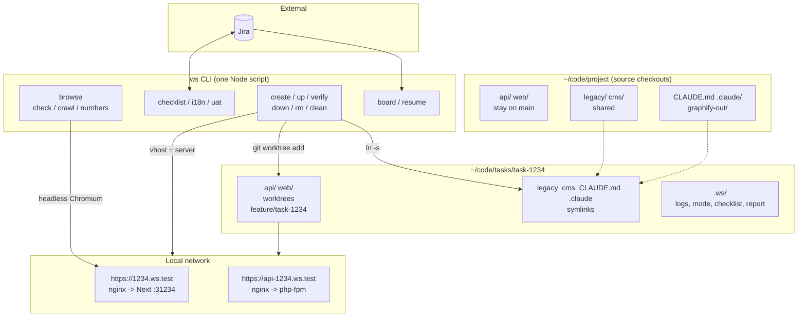
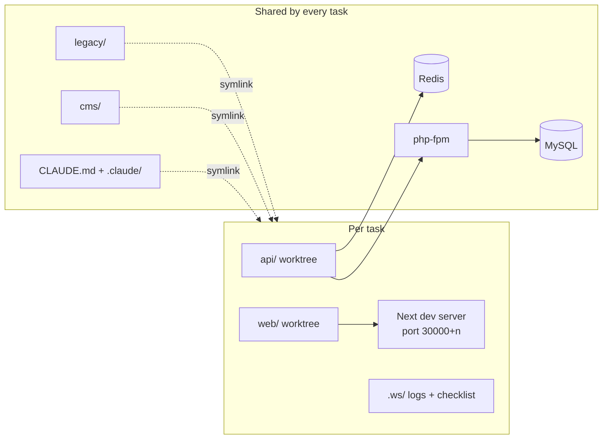

# 1. Architecture and principles

## Component map

Claude Code always opens in `~/code/project`, moves into the task folder itself, and runs the same `ws`
commands a human would.

## Principles

| Principle | In practice |
|---|---|
| One task, one space | Task code is edited only under `tasks/task-<n>/`. Root `api/` and `web/` stay on main. |
| Diagnose, ask, then fix | Claude shows file:line, cause and fix, then waits. |
| Humans commit and push | Claude proposes message and file list, waits for a yes. |
| Read the page, skip the tests | Every change ends with a logical check of the rendered page and its API payload ([05](05-verification-and-uat-gate.md)). |
| Close with evidence | A checklist item closes with what was seen on the page. |
| Give context up front | Repo knowledge in rule files, code relationships in a graph; both before grep. |
| Hooks enforce rules | Typography, slop and graph-first are hooks, not just text. |
| One tool for agent and human | `ws` behaves the same in a terminal and in Claude's Bash tool; output is short plain text. |

## Shared vs per-task

| Resource | Scope | Consequence |
|---|---|---|
| `api/`, `web/` | Per task | Own branch and server |
| `legacy/`, `cms/` | Shared | A change shows up in every task; Claude warns before editing |
| Database, Redis, php-fpm | Shared | Open tasks are listed before a migration or cache flush |
| `CLAUDE.md`, `.claude/` | Shared | Sessions inside a task folder keep the same hooks and agents |

`legacy/` and `cms/` are not worktrees: they change rarely and are expensive to set up per task
(WordPress, a multi-host framework). We took the trade-off and made the warning a rule.
