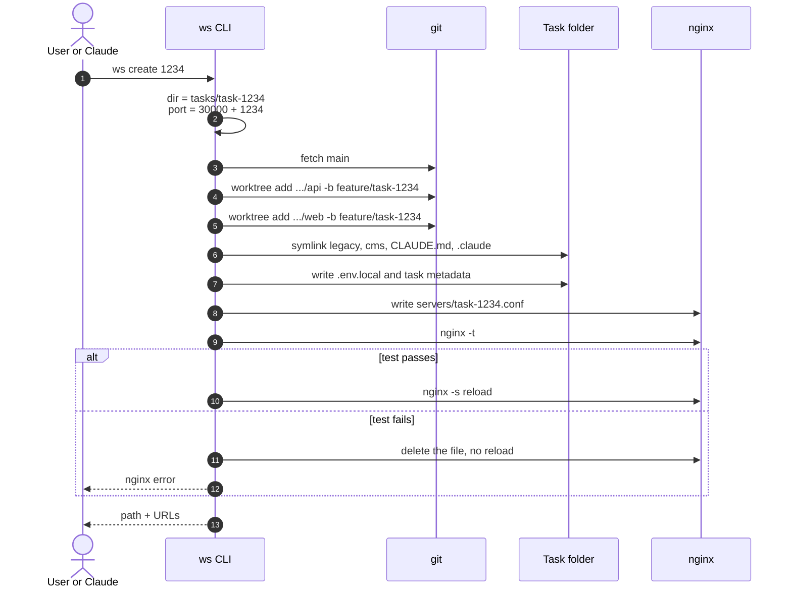
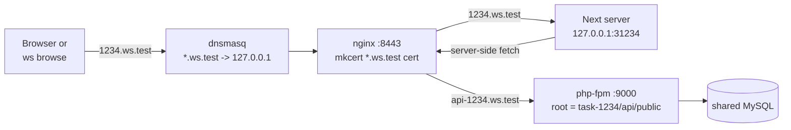
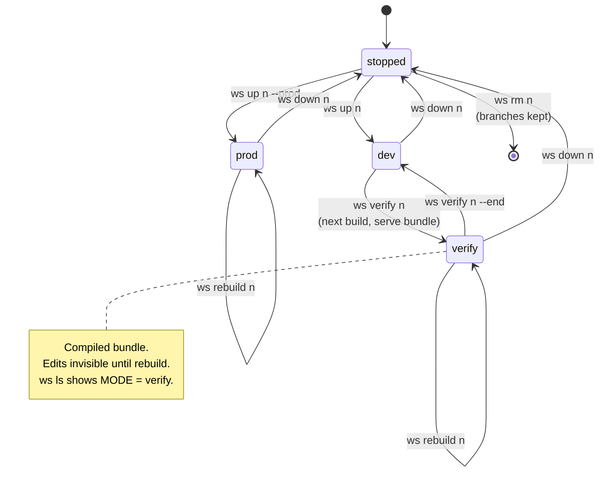
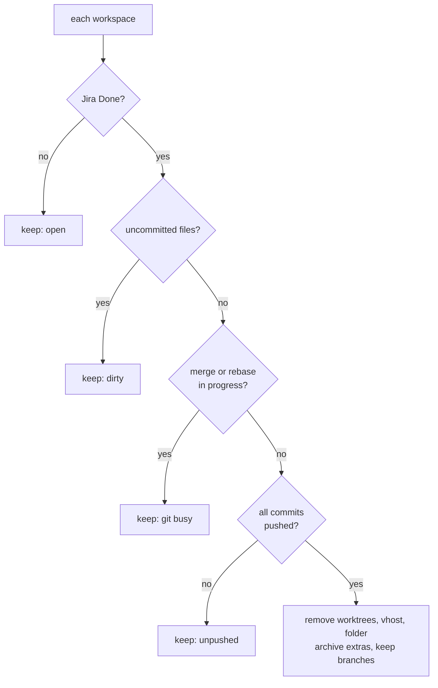
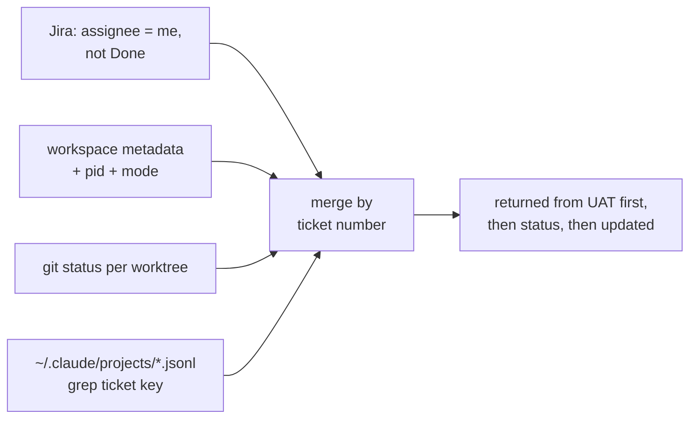

# 2. Task workspaces and the `ws` CLI

## Goal

`ws create 1234` gives you, in about two minutes:

- `feature/task-1234` branches and worktrees for `api/` and `web/`,
- env files in the task folder,
- `https://1234.ws.test:8443` (frontend) and `https://api-1234.ws.test:8443` (API),
- after `ws up 1234`, a Next dev server for that task alone.

Source checkouts stay untouched. Five tasks can run side by side.

## `ws create`

## Routing

| Part | How | Note |
|---|---|---|
| Code | `git worktree add` per repo | `node_modules` per worktree; first install is the slow step |
| Shared repos | Symlinks for `legacy`, `cms`, `CLAUDE.md`, `.claude` | Without `.claude`, a session in the task folder loses hooks and agents |
| Port | `30000 + task number` | No collisions, nothing to remember |
| DNS | dnsmasq `address=/ws.test/127.0.0.1` | Set once |
| HTTPS | mkcert wildcard for `*.ws.test` | Browsers block XHR from an https page to an http API; Node trusts it via `NODE_EXTRA_CA_CERTS` |
| Routing | One nginx vhost per task | Reverted if `nginx -t` fails |
| API | nginx -> shared php-fpm, root in the task worktree | Process shared, code per task |
| Process | Detached Next server; pid and mode in `.ws/` | `.ws/server.log`, `.ws/build.log` |
| Memory | Turbopack memory cap injected into each `next dev` | Keeps the machine usable with many tasks |

Template: [templates/nginx/task-vhost.conf.example](../templates/nginx/task-vhost.conf.example).

## Server modes

`next dev` skips minification, static generation and ISR, so a page can pass in dev and break in the release
build. All modes use the same URL:

Dev starts in seconds and reloads on save; the build takes 1-3 minutes and is used once before pushing.
`verify` is a check session that returns to dev with `--end`; `prod` serves a release build until stopped,
and `ws rebuild` rebuilds whichever build mode is running.
Source maps stay on in the build.

## Commands

| Group | Commands |
|---|---|
| Workspace | `setup`, `create`, `up`, `verify [--end]`, `rebuild`, `down`, `ls`, `rm`, `clean` |
| Jira | `config` (token in the OS keychain), `jira`, `board`, `resume`, `export` |
| Quality | `checklist`, `i18n`, `uat` |
| Browser | `browse open/click/type/eval/shot/check/crawl/numbers` |

Design choices:

- One Node script, no npm dependencies except the browser daemon. Install = symlink.
- Without a number, the task comes from the branch name (`feature/task-<n>`).
- `setup` prints root steps instead of running them.
- `rm` keeps branches and archives files you added.
- `resume` picks a returned ticket and a past session for it, and runs `claude --resume <id>` in a new tab.

### `ws clean`

### `ws board`

One JSON, so Claude answers "where do things stand" in a single call:

## Adapting it

- Make the port base and TLD env vars.
- Worktree only the repos that change often.
- Let the CLI write env files; hand-copied ones break first.
- Symlink every task's logs into one folder (`tasks/.logs/`) so Claude knows where to look.
