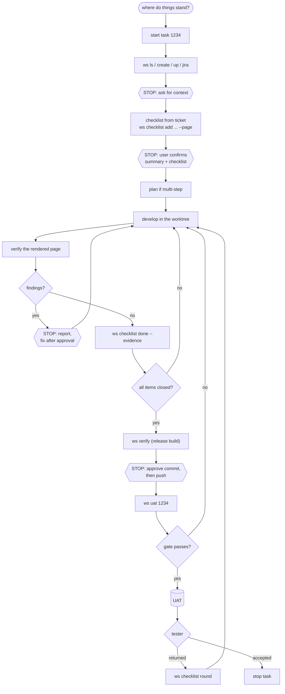
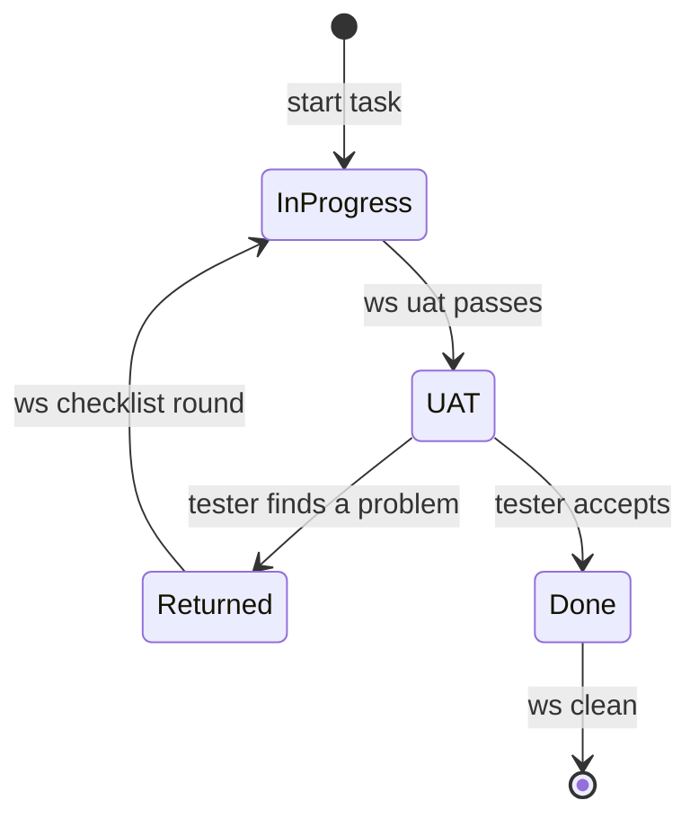
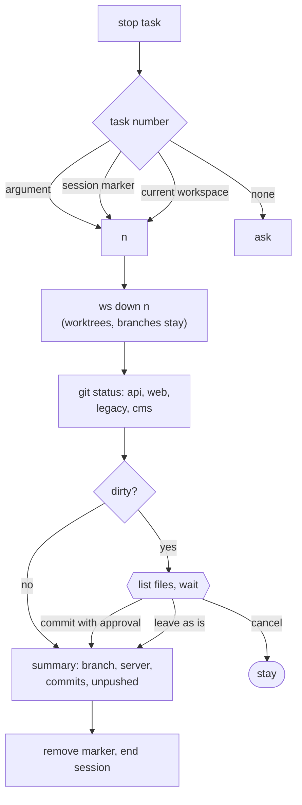

# 3. Workflow

## A ticket end to end



Hexagons are stops where Claude waits for a person.



## "Where do things stand?"

The `status` skill runs `ws board --json` and lists, in order: tickets back from UAT, uncommitted work,
servers left running, then other statuses as counts. Five lines you can act on instead of 30 tickets.

## `start task 1234`

The CLAUDE.md trigger and `/start-task` run the same steps:

1. `ws ls` to show clashes early.
2. `ws create 1234 --yes`, `ws up 1234`; the task number is saved under the session id.
3. All reads and edits move to the task folder.
4. `ws jira 1234`: ticket summary and URLs.
5. Claude asks for extra context and **stops**.

The stop matters: Slack threads, spreadsheets, screenshots and "copy that page" rarely make it into the ticket.

## Checklist, before code

One item per checkable requirement, each tied to a page:

```bash
ws checklist 1234 add "Product table has a price filter" --page /products
```

Numbered lists and "also..." sentences become separate items. Claude sums up the task in 3-6 lines, lists
open questions and waits for confirmation. Skipped items were our top UAT return reason, so this step pays most.

## Development

Small jobs go straight in. Multi-step jobs use superpowers: brainstorm, plan, execute with sub-agents,
debug systematically. Plans go to a gitignored folder.

- Bug found: diagnosis first, fix after approval.
- Shared repo (`legacy/`, `cms/`): warn before editing.
- Broken page: read `.ws/server.log` and `.ws/build.log`, do not guess.

## Verification

After each change, `page-logic-verifier` (or Claude) reads the page with `ws browse check/crawl/numbers`
and reports. Items close with evidence:

```bash
ws checklist 1234 done 1.3 --evidence "/tr/products: filter shows 12 price ranges, browse check clean"
```

## Hand-over

1. `ws verify 1234`, check changed pages, `ws verify 1234 --end`.
2. Claude proposes the commit; commit and push each need approval.
3. `ws uat 1234` blocks on open items, unpushed work, missing keys or page errors. On pass it writes a report
   and moves the ticket. `--force` is a human decision.

A return: `ws resume` reopens the old session; `ws checklist 1234 round` prints the tester's notes since
hand-over, each becomes an item, then back through the gate.

## `stop task`



No stash, reset or discard, ever.
