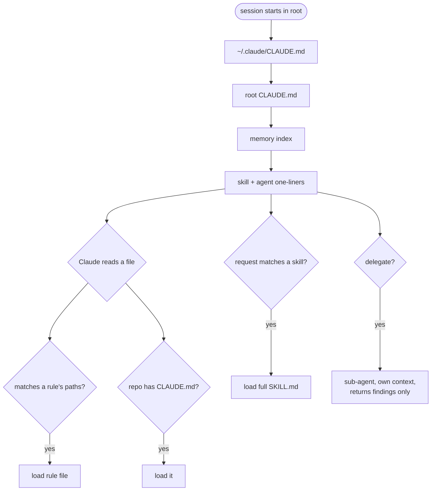
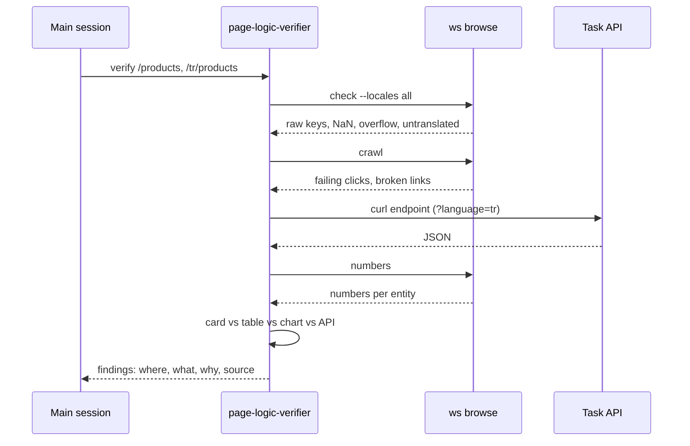
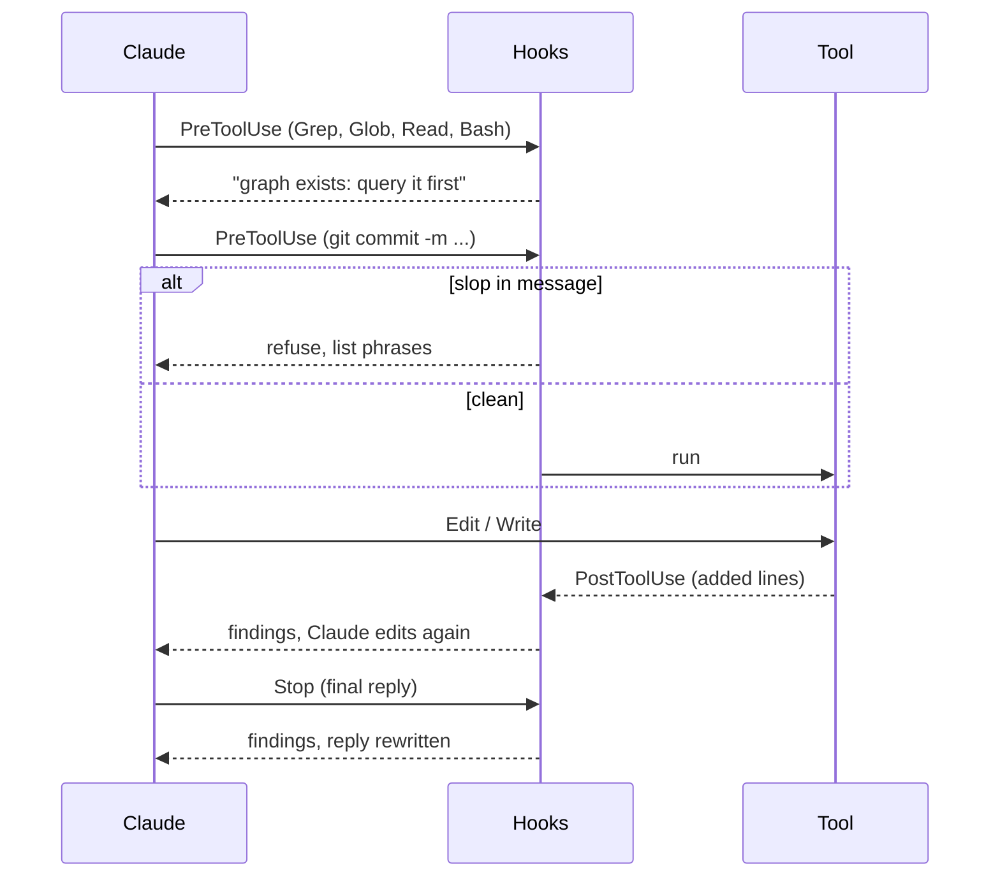

# 4. Claude Code configuration

## Layers

| Layer | File | Loaded when | Holds |
|---|---|---|---|
| User | `~/.claude/CLAUDE.md` | Every session | Personal skill triggers |
| Project | `<root>/CLAUDE.md` | Sessions in the root | Repo map, prohibitions, processes, typography, verification policy |
| Repo | `web/CLAUDE.md` etc. | A file in that repo is touched | Short repo rules, committed in the repo |
| Rule | `.claude/rules/*.md` | A file matching `paths:` is read | Layout, DB, helpers, endpoints, code standards |
| Command | `.claude/commands/*.md` | `/command` | Step-by-step flows |
| Agent | `.claude/agents/*.md` | Claude delegates | A specialist with its own context |
| Skill | `~/.claude/skills/*/SKILL.md` | Description matches the request | A triggered knowledge pack |
| Hook | `.claude/settings.json` | Around tool calls, end of reply | Enforced checks |
| Memory | `~/.claude/projects/<project>/memory/` | Every session (index) | Preferences learned from corrections |



Rule of thumb: short and strict goes in CLAUDE.md, long reference goes in `rules/`. Moving the repo reference
into rule files stopped frontend sessions from loading PHP standards.

## Root CLAUDE.md

Template: [templates/CLAUDE.md](../templates/CLAUDE.md).

| Section | Purpose |
|---|---|
| Codebase overview | Four repos, roles, where rules live |
| Git | Root is not a repo; always `git -C <repo>` |
| Typography | No em/en dashes; pointer to the slop list |
| Verification: no tests | Read the page; overrides TDD steps in skills |
| Never without confirmation | Bug fixes, commits, pushes, dropping tables, infra changes |
| Always safe | Search, read, static analysis, cache clears |
| Output | Gitignored folders for reports, scratch scripts, AI plans |
| Processes | Workspaces, `start task`, checklist and UAT, `stop task` |
| Code graph | Graph query before grep |

List prohibitions and give each rule a one-line reason; Claude handles edge cases better when it knows why.

## Path-scoped rules

```markdown
---
paths:
  - "web/**"
---
# web/ - Next.js frontend
```

One per repo, plus a shared security-review file. Example: [templates/.claude/rules/web.md](../templates/.claude/rules/web.md).

In our setup, rules did not always auto-load for files outside the session root (a task worktree). CLAUDE.md tells Claude to read
the matching rule by full path before its first edit there.

## Commands, agent, skill

| Name | Type | Job |
|---|---|---|
| `/start-task <n>` | Command | Workspace, ticket, stop for context, checklist |
| `/stop-task [n]` | Command | Stop server, flag uncommitted work, summary, exit |
| `page-logic-verifier` | Agent (read-only, smaller model) | Reads page and API payload, reports inconsistencies |
| `status` | Skill | "Where do things stand" via `ws board` |

The agent keeps page dumps, screenshots and JSON out of the main session; only findings come back:



A skill is chosen by its `description`, so put the phrases people actually type there, in every language they use.

## Hooks



Template: [templates/.claude/settings.json](../templates/.claude/settings.json). Paths use `$CLAUDE_PROJECT_DIR`.

## Memory

- Built-in memory: one fact per file, index loaded each session. Examples: "never commit without consent",
  "no tests, read the page", "flag a card whose extra line stretches its row". Only store what the code cannot tell.
- The remember plugin: session logs, with a summary of recent days injected at start.

## Permissions and auto mode

| File | Scope | Content |
|---|---|---|
| `.claude/settings.json` | Project, shared | Read-only commands and hooks |
| `.claude/settings.local.json` | Personal | Approvals pile up here, tokens included. Never share it. |
| `~/.claude/settings.json` | User | Read permissions, plugins, status line, `autoMode` |

In auto mode, `autoMode.environment` tells the classifier which domains are trusted, what counts as production
and where secrets live; `soft_deny` sends force pushes and production config writes back to a prompt.

Keep shared allowlists narrow. Blanket `Read` plus unrestricted `curl` GET lets a prompt injection read a
secret and send it out in a URL, unprompted.
