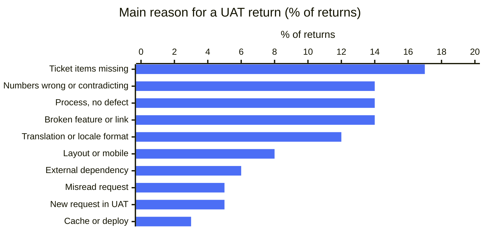
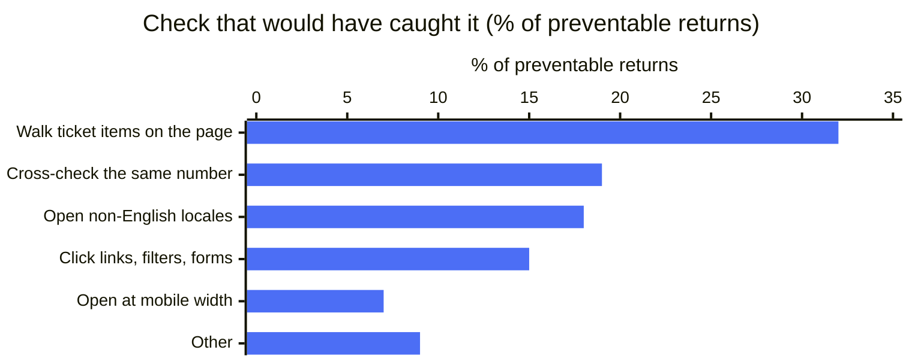
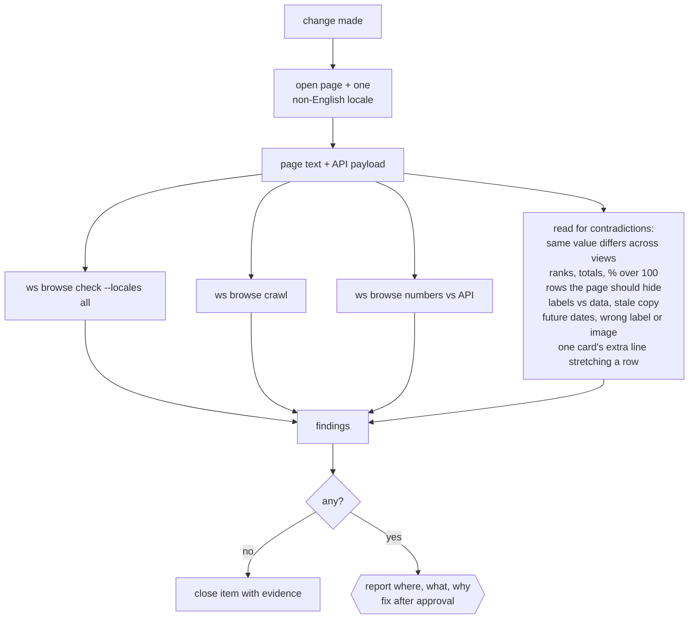
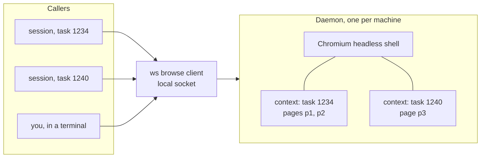
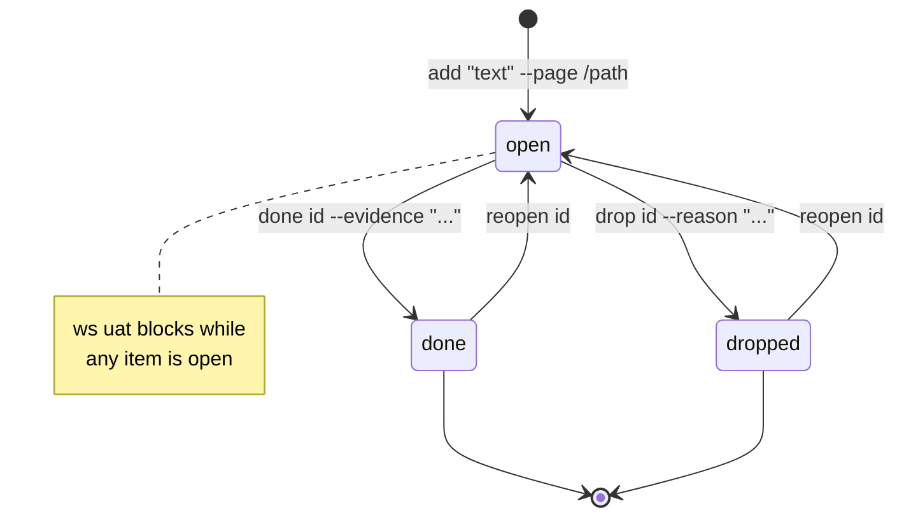
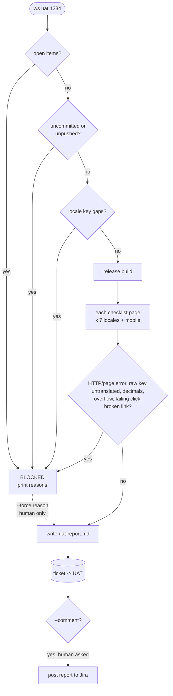

# 5. Verification and the UAT gate

## Why pages, not tests

We took about six months of UAT returns from Jira (status changes plus comments around each return),
labelled them against a fixed reason list with three separate model runs, and spot-checked by hand.
About a third of hand-overs had come back at least once.

About 70% were preventable, and not by unit tests. The check that would have caught each one:

The first five cover over 90%. So: no tests in these repos, and every change ends with those five checks,
done by tools. CLAUDE.md says this overrides any "write a failing test first" step.

## The verification pass

Run by the [page-logic-verifier](../templates/.claude/agents/page-logic-verifier.md) agent.

## `ws browse`: one browser for all agents

Playwright MCP started a browser per session with long output, and five parallel tasks ran the machine out of
memory. We replaced it with one headless Chromium daemon (`playwright-core`, about 1,100 lines):

- One context per task; a session cannot touch another task's pages.
- Text output: an outline with `[eN]` refs on open, only the diff on click.
- Images, fonts and analytics blocked by default.
- Idle pages close after 10 minutes, the daemon after 15.

| Command | Catches |
|---|---|
| `check <url> --locales all` | Per locale: raw keys, `NaN`/`undefined`/`null`, broken images, duplicate rows, h1 count, `lang` mismatch, console/HTTP errors, copy still in English, `.` decimals on comma locales, 390px overflow (with screenshot) |
| `crawl <url>` | Every button, tab, select and checkbox clicked one by one; failures and 4xx/5xx links listed |
| `numbers <url>` | Numbers per entity from tables and cards, to compare with the API |

`ws i18n` checks key parity across all locale files.

## Checklist

Evidence means URL, what is visible, which check came back clean. "Done" alone does not count.

## `ws uat <n>`

The only way into UAT:

Posting to Jira and `--force` are human calls; CLAUDE.md forbids Claude from doing either alone.

Next: after a month with the gate, relabel returns the same way and see if the preventable share drops.
