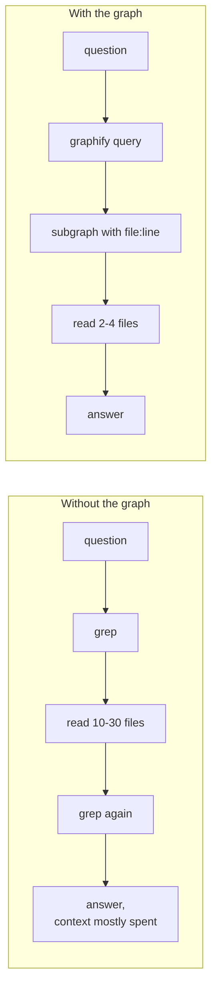
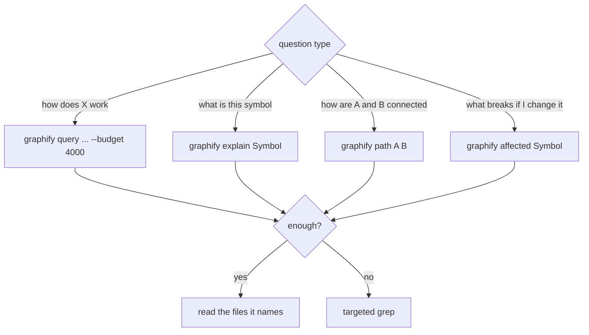
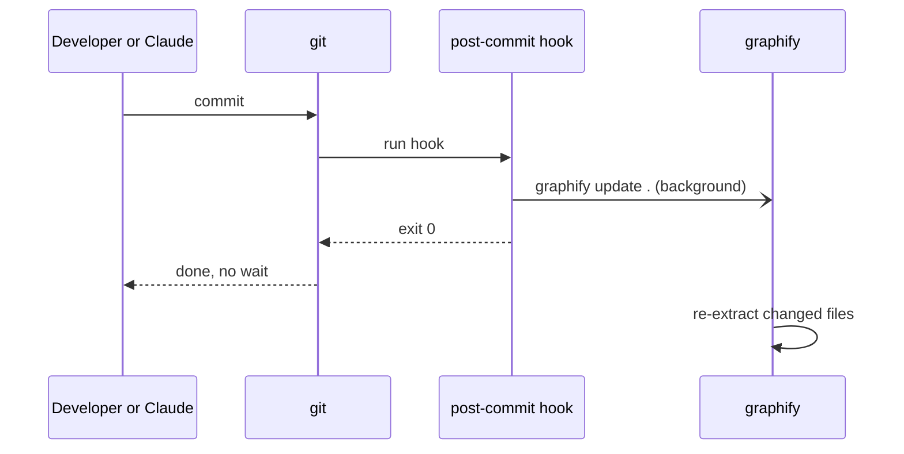

# 6. Code graph (graphify)

## Why

Four repos, PHP and TypeScript, calls across repos (frontend service -> API route -> controller -> table).
Claude grepped and read dozens of files per question. [graphify](https://pypi.org/project/graphifyy/) builds a
graph from the AST (about 9k nodes, 25k edges here) and Claude pulls only the relevant subgraph.



## Setup

```bash
uv tool install graphifyy
graphify install --platform claude        # /graphify skill
cd ~/code/project && graphify update .    # AST only, no LLM cost
```

`.graphifyignore` keeps out WordPress, vendor code, images and minified files. Minified files filled the graph
with one-letter symbols, so they went first.

## Queries



- The default 2000-token budget cuts architecture answers short; use 4000.
- Builtins like `trim` and `json_decode` flood broad queries; `explain` and `path` stay focused.
- Nodes with no source file are builtins.

## Steering Claude

- CLAUDE.md: graph first for code questions.
- A hook (`graphify hook-guard`) reminds Claude before `Grep`, `Glob`, `Read` or a search in `Bash`.
- Graph commands need no approval.

## Keeping it fresh



Template: [templates/git-hooks/post-commit](../templates/git-hooks/post-commit).
