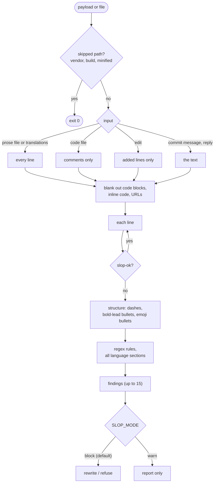

# 7. Slop check

## Problem

Claude's text ends up in commits, PRs, comments, UI copy and translations in 7 languages. Familiar AI
patterns (`delve`, `seamless`, `leverage`, "not only X but also Y", em dashes, bold-lead bullets) signal  <!-- slop-ok -->
that nobody read it. A banned list in CLAUDE.md did not survive long sessions.

## Answer

A dependency-free Python script plus a rule file ([templates/.claude/slop/](../templates/.claude/slop/)),
run by three hooks:

| Hook | Checks | Result |
|---|---|---|
| PostToolUse `Edit\|Write\|MultiEdit` | Added lines only. Comments in code; all text in `.md`, `.txt`, `.html`, translation files | Claude edits again |
| PreToolUse `Bash` | `git commit`, `gh pr` messages | Command refused |
| Stop | Final reply | Reply rewritten |



Runtime LLM output (machine translation, generator plugins) is out of scope.

## Rules

```
[en]
leverag(e|es|ed|ing) => "use"
not only\b.{0,60}\bbut also => say both things plainly
```

`<regex> => <hint>`, case-insensitive. A word boundary is added at the start only, so suffixes still match
(useful for Turkish and German). Sections: `[en] [tr] [de] [es] [fr] [it] [pt]`. Hints ask for a plain
rewrite, not a synonym. Add a rule after seeing a pattern twice; drop it if it keeps misfiring.

## Use

```bash
python3 .claude/slop/slop_check.py draft.md        # exit 1 = findings
pbpaste | python3 .claude/slop/slop_check.py -      # stdin
python3 .claude/slop/slop_check.py --json file.md
```

The verification agent also pipes rendered page text through it. False positive: add `slop-ok` to the line.
Warnings only: `SLOP_MODE=warn`.
