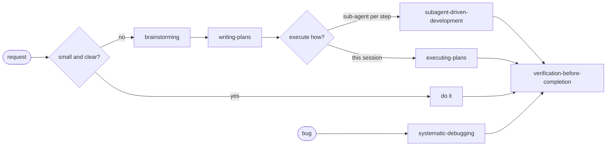
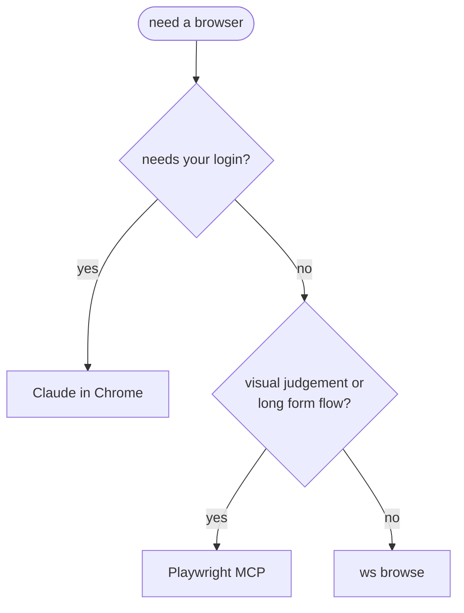

# 8. Plugins, skills and MCP servers

## Plugins

From the official `claude-plugins-official` marketplace.

| Plugin | Use |
|---|---|
| superpowers | Process skills: brainstorming, plans, systematic debugging, evidence before "done", code review |
| remember | Session logs; recent days summarised at start |
| atlassian | Confluence search, Jira tasks from meeting notes, sprint summaries |
| playwright | Browser checks that need visuals or a login |

## superpowers in this project



Two defaults are overridden in CLAUDE.md: TDD steps (replaced by page checks) and committing plans (they go
to a gitignored folder).

## Built-in commands

| Command | Use |
|---|---|
| `/code-review`, `/simplify`, `/security-review` | Review, cleanup, security |
| `/fewer-permission-prompts` | Allowlist from read-only commands in past sessions |
| `/hooks`, `/agents`, `/plugin` | Check the setup |

## Browsers and MCP



An editor MCP server lets Claude read the active file, selection and open files when you say "this file".

## Status line

Folder, model and context use on the bottom line, so you see when to start a fresh session:

```sh
#!/bin/sh
input=$(cat)
dir=$(basename "$(echo "$input" | jq -r '.workspace.current_dir // .cwd')")
model=$(echo "$input" | jq -r '.model.display_name // empty')
used=$(echo "$input" | jq -r '.context_window.used_percentage // empty')
printf '%s | %s | ctx: %s%%' "$dir" "$model" "$(printf '%.0f' "${used:-0}")"
```
