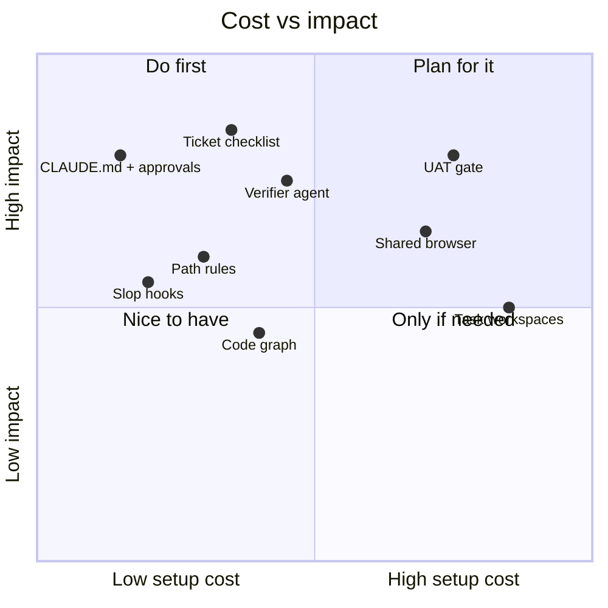
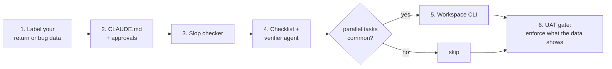

# 9. Lessons

## What worked

| Lesson | Detail |
|---|---|
| Data before tools | We assumed "more tests". Labelled returns showed skipped items, contradicting numbers and missing translations. |
| Hooks over text | Prohibitions in CLAUDE.md fade in long sessions; hooks do not. |
| One CLI for agent and human | Short output, called from Bash. One thing to maintain, and people can run it too. |
| Stops | Context question, checklist approval, fix approval. Code written too early costs the most. |
| Evidence | "Which URL, what did you see", enforced by checklist and gate. |
| Protected context | Verification in a sub-agent, reference in path rules, code questions in the graph. |
| Predictable addresses | Port and host derive from the task number; Claude can work out the URL. |
| Status in one call | Jira, workspaces, git and past sessions in one JSON. |

## Pitfalls

| Symptom | Cause | Fix |
|---|---|---|
| Edits not showing | Server left in build mode | MODE column in `ws ls`; always end verification |
| No hooks in task session | No `.claude` in task folder | Symlink it |
| Rule file not loaded | File outside session root | "Read the rule first" in CLAUDE.md |
| One task broke another | Shared repo or DB | Warn before shared edits; list tasks before migrations |
| Edit in source checkout | Lost track of the task | Session marker + explicit rule |
| Slow machine | Many dev servers | Memory cap, `ws down`, `ws clean` |
| Token in allowlist | Personal permissions store commands verbatim | Never share it; tokens from env vars |

## Where to start

Our five checks fit our returns. Label yours first and let that pick the tools.
