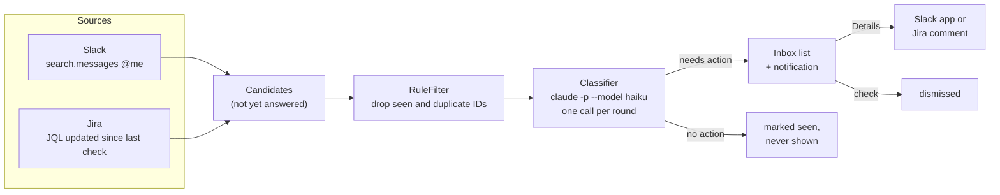
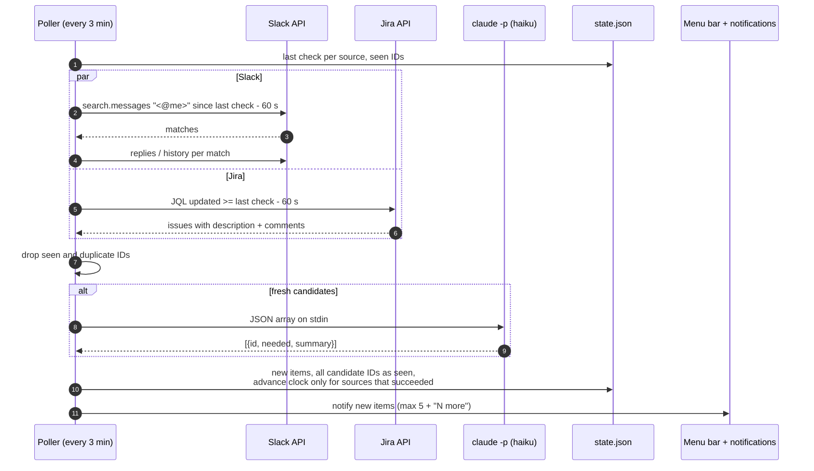
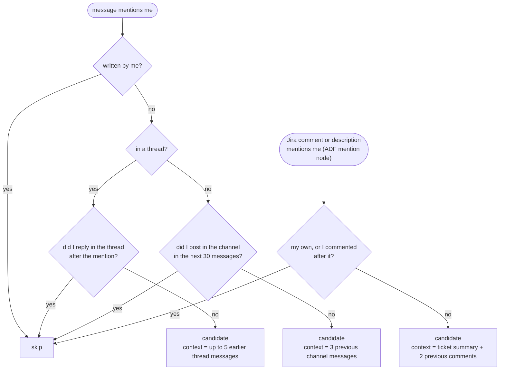
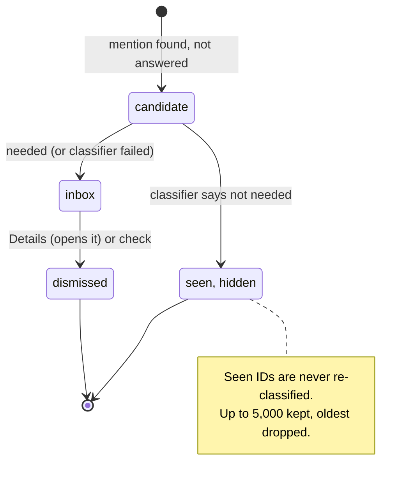

# 10. Notification inbox

## Problem

Requests arrive as Slack and Jira mentions, mixed in with thanks, FYIs and messages meant for someone else.
"Can you take a look?" in a busy channel is easy to miss, and Jira's own notifications do not say what is
being asked. `ws board` covers tickets; this covers people asking for something.

## What it does

A small macOS menu bar app (Swift, about 1,050 lines, no dependencies) that every 3 minutes:

1. collects Slack and Jira messages that mention you and that you have not answered yet,
2. asks Claude, in one call, which of them need action from you and for a one-line summary of each,
3. shows only those, as a desktop notification and in a list; **Details** opens the message in Slack or the
   Jira comment in the browser.



## One round



## Who counts as "not answered yet"



Context matters: a DM that only says "can you look?" gets a useful summary only because the previous
messages go along with it.

## The classifier

One `claude -p` call per round, only when there are fresh candidates:

```bash
claude -p --model haiku --output-format json \
  --system-prompt "<rules below>" \
  --tools "" --strict-mcp-config --setting-sources "" \
  --no-session-persistence --settings '{"alwaysThinkingEnabled":false}'
```

The system prompt, in short: *needed* = you are asked a question, asked for work, review, approval or an
answer, or something you own is broken. Thanks, FYIs, celebrations and tasks given to others are not needed.
*summary* = one sentence, at most 90 characters, second person ("X wants you to check why..."); keep numbers,
units and names exactly as written; output only a JSON array.

| Choice | Why |
|---|---|
| One call for the whole batch | One process start and one quota hit per round, not per message |
| Smallest model, thinking off | Thinking made 7 items take about 80 s; off, about 7 s with the same output |
| `--tools ""`, no MCP, no settings | Message text is untrusted input; with no tools, a crafted message can at worst change its own verdict or summary |
| "Keep numbers verbatim" rule | An early run turned "4+ nights" into "4+ hours" |
| Previous messages as context | Short DMs ("can you look?") had no content to summarise |
| Hard timeout, then SIGKILL after 3 s | `claude` once ignored SIGTERM and a round hung for minutes |

**Failure is loud, not silent.** If the call fails, times out or returns bad JSON, every candidate is shown
as needed, with the first 100 characters of the raw message as the summary, and a warning line at the top.
If the model skips an item, that item is shown raw. Nothing disappears because the model broke.

## Item lifecycle



## Other design choices

| Choice | Why |
|---|---|
| Credentials from the Keychain via `/usr/bin/security` | The app is ad-hoc signed; its signature changes on every build, and the Keychain API asked for approval each time, blocking the poll |
| Jira credentials shared with the `ws` CLI | One `ws config`, two tools |
| Clock advances only for sources that succeeded | A Slack outage does not lose Slack messages; the next round asks again from the old time |
| 60-second overlap on every query | Search indexing lags a few seconds; duplicate IDs are dropped anyway |
| State in one JSON file | List, seen IDs and last check times survive restarts; the window opens instantly from it |
| `--dump [--hours N]` mode | Runs one round without touching state and prints every candidate with its verdict, to check the classifier against the raw messages |
| Plain `swiftc` build script, no Xcode | Built with Command Line Tools only |

## Verification

Same rule as the rest of the guide: no tests, check the output. The dump mode puts every candidate next to
its verdict for a time window, so each message is either in the list or has a stated reason to be out
(own message, answered, not needed). Then: Details on a channel message, a DM, a thread and a Jira comment;
the same item does not notify twice; idle memory and CPU measured with `ps`.

## Known limits

| Limit | Effect | Possible fix |
|---|---|---|
| Binary decision, newest first | No ranking by urgency; an outage alert and a review request look the same | Ask the model for a priority (for example urgent / today / later) and sort by it |
| Channel "answered" check looks for any post by you in the next 30 messages | In a busy channel an unrelated post hides a real request | Count only replies that mention the author or quote the message |
| Answered items stay in the list | If you answer in Slack directly, the item stays until dismissed | Re-check open items for a reply each round |
| Jira JQL time is formatted in the Mac's time zone | Jira reads it in the profile's time zone; if they differ, the window shifts and mentions can be missed | Query with a wider overlap, or convert to the profile's time zone from `/myself` |
| Per-match Slack calls, no rate-limit handling | A large first window can hit 429; the failed source retries from the same time and can keep failing | Back off on 429, cap the first window |
| Jira search reads one page (50 issues) | A long first window can miss issues | Paginate |
| "Not needed" is final | A misjudged message never comes back | Keep a "hidden" view, or re-show if a new message arrives in the same thread |
| Message text goes to the Claude API | Company chat content leaves the machine | Check this against your data policy before rolling it out |

The tool is single-user by design: user, workspace and Jira host are constants.
