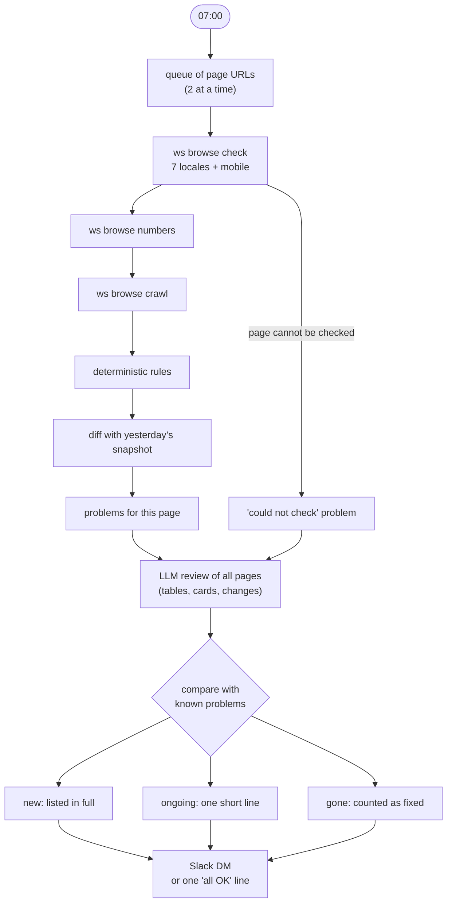
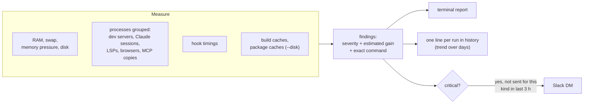
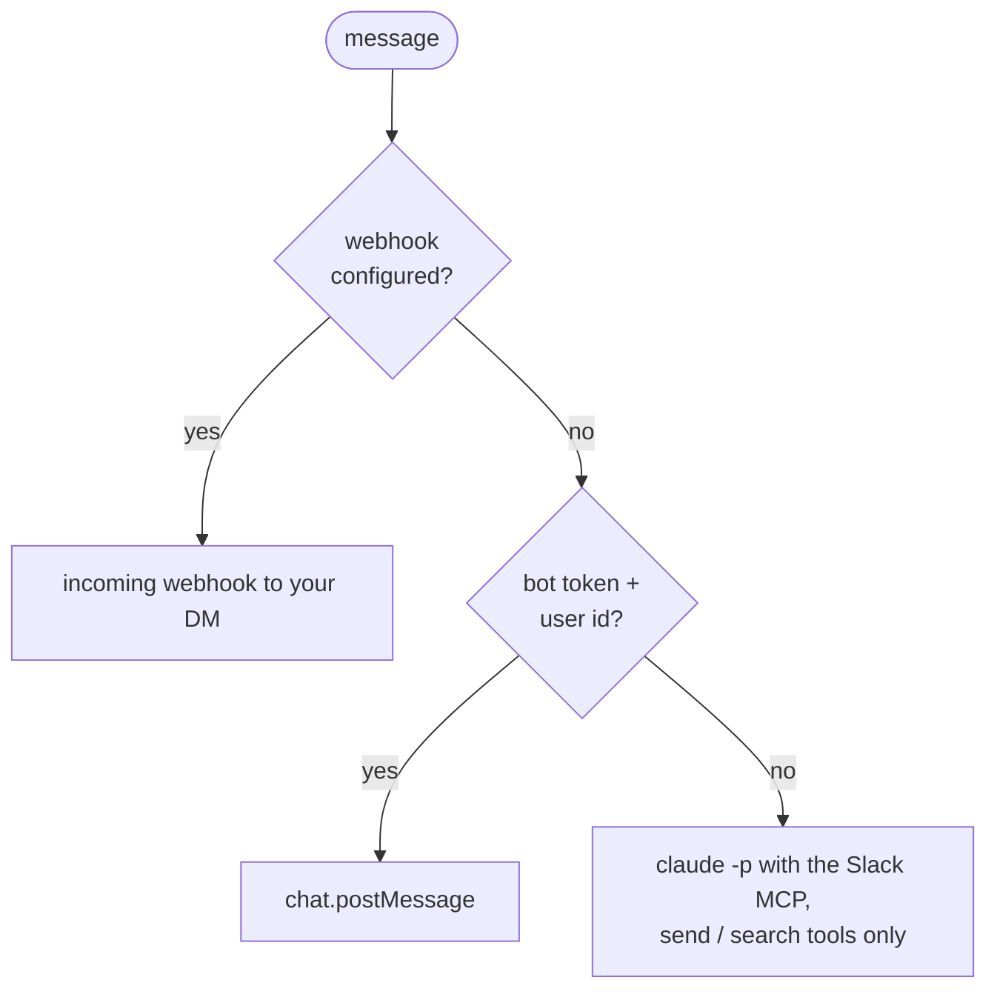

# 11. Background automation: watch, maintain, doctor, notify

## Why

The UAT gate checks a page once, at hand-over. Pages break later too: a data import, another ticket, a
translation run. And a machine running five dev servers, several Claude sessions and a headless browser
slows down without saying why. Four `ws` commands run on their own and report to a personal Slack DM.

| Command | When | Job |
|---|---|---|
| `ws watch` | Daily, 07:00 | Logic check of the pages you own on the test site, with a diff against yesterday |
| `ws maintain` | Daily, 06:00 | Clean-up: finished workspaces, idle servers, logs, caches, old transcripts |
| `ws doctor` | Every 5 minutes (sampling), on demand (report) | Read-only report of what slows the machine down, with a command per finding |
| `ws notify` | Used by the three above | One Slack DM channel for all of them |

All three jobs are macOS LaunchAgents (`ws <cmd> service start|status|stop`), so they survive restarts
and need no server.

```mermaid
gantt
    title A normal morning
    dateFormat HH:mm
    axisFormat %H:%M
    section maintain
    clean-up, then summary DM        :m, 06:00, 50m
    section watch
    6 pages x 7 locales + mobile     :w, 07:00, 40m
    LLM review + DM                  :after w, 10m
    section doctor
    sample every 5 min, DM on critical :d, 06:00, 180m
```

## `ws watch`: daily page logic check

What each layer catches:

| Layer | Catches |
|---|---|
| `browse check` | Raw translation keys, `NaN`/`undefined`/`null`, untranslated copy, wrong decimal separator, `lang` mismatch, broken images, duplicate rows, HTTP and page errors, mobile overflow |
| `browse crawl` | Clicks that throw, 4xx/5xx links |
| Rules | A table mostly sorted by its score column with a row out of order; percentages over 100; negative prices or times; a "top model" card that does not name the table's first row; a card number that is not in that entity's row |
| Diff | A locale that returned 200 yesterday and an error today; new console errors; row count changing by more than 20%; a top-10 entity gone or moved more than 5 places; a score moving more than 30% |
| LLM review | What rules cannot see: an entity under the wrong company, a price that cannot be right, the same thing under two names, a change that looks like a data error rather than an update |

The known-problems list is what keeps the DM short: a problem is written out in full on the first day, then
shows up as one "ongoing" line until it disappears.

The review prompt asks for "only real logical problems a careful reader would flag" and "nothing you are
unsure about", as a JSON array. Rules run first and the model only adds to them, so a model outage costs the
extra layer, not the report.

## `ws maintain`: daily clean-up

Each step logs what it did and never stops the others:

1. `ws clean --yes`: remove finished workspaces (same safety rules as by hand: finished status, clean,
   everything pushed; branches kept).
2. Stop dev servers with no log output for 8 hours.
3. Restart dev servers that have been up for 24 hours (Turbopack memory grows).
4. Kill headless browsers whose Claude session is gone.
5. Trim task logs over 50 MB to their last 5 MB.
6. `git worktree prune` in the source checkouts.
7. Package-manager cache clean-up.
8. Gzip Claude transcripts untouched for 30 days.
9. User cache clean-up (no sudo).
10. Save yesterday's doctor report.

Then one notification and one DM: disk free and swap, before and after.

## `ws doctor`: what is slowing the machine

Read-only. It measures, explains and prints the command to run; it never stops anything itself.

A background sampler runs it every 5 minutes; `ws doctor report` turns a day of samples into a timeline.
CLAUDE.md lets Claude run it when things feel slow, but not act on its kill or stop suggestions without you.

## `ws notify`: one channel for all of it

Config lives in one `chmod 600` file. `ws notify test` sends a test message. Long reports are cut so Slack accepts them.

## Lessons from the first week

| What happened | Cause | Fix |
|---|---|---|
| The morning report swung between "88 new" and "85 fixed" | A page that could not be checked had no problems that day, so its known problems were counted as fixed, then came back as new | Carry an unchecked page's known problems over unchanged |
| On some mornings every page "could not be checked" | Most likely load: clean-up was still running at 07:00 (a cache clean-up hit its one-hour timeout) while the browser daemon started | Start the page check after clean-up finishes, and cap the slow steps |
| The review model ran with default tools | Page text is input from outside; the inbox and estimate tools already run their models with `--tools ""` | Run every background `claude -p` without tools unless it needs one, and then allow only that one |

The general rule we took from it: a background job reports on its own coverage. "6 pages checked, 0
problems" and "0 of 6 pages checked" are different messages and must not look the same.
