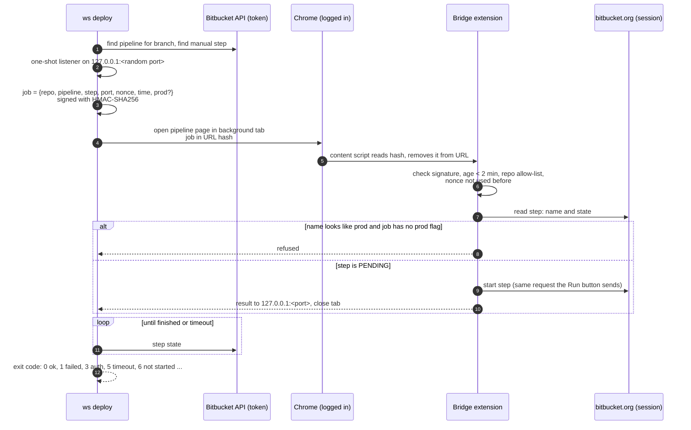
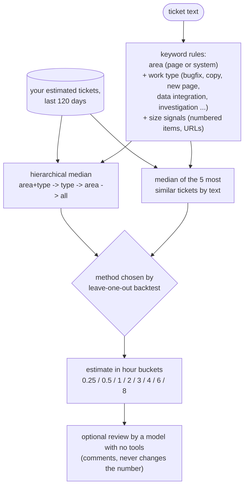
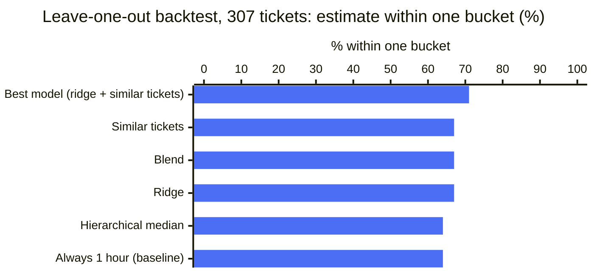

# 12. Deploy from the terminal, estimate from history

Two smaller `ws` commands that close gaps at both ends of a ticket: `ws estimate` before work starts,
`ws deploy` when it is ready to show.

## `ws deploy`: pressing "Run" on a manual pipeline step

Feature, test and production deploys are manual steps in Bitbucket Pipelines. Pressing them meant opening
the browser, finding the pipeline for the branch and clicking Run, for every repo.

```bash
ws deploy 1234                      # feature branch, frontend + API "Feature Deploy" steps
ws deploy 1234 --repo=api           # one repo
ws deploy test --repo=web,api       # test branch
ws deploy production ... --prod     # production: --prod required, then a confirmation prompt
ws deploy 1234 --status --json      # just read the state
```

Reading pipelines and waiting for a step works with an API token. Starting a manual step does not:
Bitbucket refuses API tokens on that endpoint. So starting goes through a small Chrome extension that uses
the browser session you are already logged in with.



Safety design:

| Risk | Guard |
|---|---|
| A crafted link starts a deploy | Jobs are HMAC-signed with a secret created by `ws deploy bridge-setup` (Keychain + extension config, `chmod 600`) |
| A reload or a copied URL replays a job | Job removed from the URL at once; nonce stored, single use; 2-minute expiry |
| A job for another repo or a production step | Repo allow-list in the extension; the step name is re-read there, and anything that looks like production is refused unless the signed job says `prod` |
| The URL is built from untrusted input | The extension builds the Bitbucket URL from verified fields only |
| Production by accident | `--prod` is required, and a confirmation prompt follows unless `--yes` |
| The start request reports an error but the step did start | The CLI does not trust the start reply; it confirms the step state through the API |

Two things to know before copying it:

- The start request is the one Bitbucket's own UI sends to an internal endpoint, not a public API. It can
  change without notice. When it does, the CLI fails with "could not start" and you press Run by hand.
- Claude's Bash tool has no terminal, so the production confirmation prompt cannot appear and the CLI asks
  for `--yes`. Nothing in the tool stops an agent from adding it. Put production deploys on the "never without
  explicit confirmation" list in CLAUDE.md and in `autoMode.soft_deny`.

## `ws estimate`: estimating a ticket the way you would

Estimates are hours in Jira. The tool learns from your own last 120 days of estimated tickets.



`ws estimate tree` prints the area -> type -> median hours map; `ws estimate backtest` measures every method
by hiding each past ticket in turn and estimating it from the rest.

### How good it is



| Method | Exact bucket | Within one bucket | Typical error |
|---|---|---|---|
| Best model | 30% | 71% | about 2x |
| Always say "1 hour" | 27% | 64% | |

The best method beats the trivial baseline by 3 points on exact hits and 7 points within one bucket, with a
typical error of about 2x. That is the honest result, and the reason we keep the backtest in the tool: it is a
sanity check ("similar tickets took about this long"), not an oracle. By area it ranges from about 40% to 89%
within one bucket; the backtest prints that per area, so you know which kinds of tickets to trust it on.
