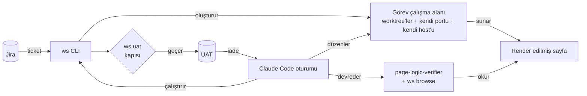

# Claude Code ekip düzeni: paralel görevler, sayfa doğrulaması ve UAT kapısı

Çok repolu bir web ürününde Claude Code'u günlük geliştirme aracı olarak nasıl çalıştırdığımız. Kurup kullanmak için değil, uyarlamak için.
Açıklamalar `docs/` altında, şablonlar `../templates/` altında.

English: [../README.md](../README.md)

## Bağlam

Tek kök altında dört repo:

```
project/
├── legacy/   in-house PHP MVC framework (multi-host)
├── api/      PHP REST API (FastRoute + Eloquent)
├── web/      Next.js frontend (App Router, 7 locales)
└── cms/      headless WordPress (content source)
```

İşler Jira ticket'ı olarak gelir. Biten ticket UAT için bir QA test uzmanına gider, bir sorun varsa geri döner.

## Bir bakışta



## Sorunlar ve çözümler

| Sorun | Çözüm | Doküman |
|---|---|---|
| Aynı anda birkaç ticket açık: branch değiştirme, sunucu yeniden başlatma, birbirine karışan değişiklikler | Her ticket için tek komutla bir worktree, port ve hostname | [02](docs/02-gorev-calisma-alanlari.md) |
| UAT'ye teslim edilenlerin yaklaşık üçte biri geri dönüyordu, çoğu önlenebilir sebeplerle | Ticket'tan çıkan checklist, unit test yerine render edilmiş sayfanın mantıksal kontrolü, zorunlu UAT kapısı | [05](docs/05-dogrulama-ve-uat-kapisi.md) |
| Claude her oturumda dört repoyu baştan keşfediyordu | Katmanlı CLAUDE.md, yol bazlı rule dosyaları, kod grafı | [04](docs/04-claude-yapilandirmasi.md), [06](docs/06-kod-grafi.md) |
| Claude'un yorumları, commit'leri, UI metinleri ve çevirileri AI metni gibi okunuyordu | Her düzenlemede, commit mesajında ve yanıtta çalışan bir slop denetleyicisi | [07](docs/07-slop-kontrolu.md) |
| İstekler Slack ve Jira etiketlerinin arasında kayboluyordu | Claude'un sadece aksiyon gerektiren etiketleri tek satırlık özetle bıraktığı bir menü çubuğu kutusu | [10](docs/10-bildirim-kutusu.md) |

## Rehber

| # | Dosya | Konu |
|---|---|---|
| 1 | [01-mimari](docs/01-mimari.md) | Parçalar, ilkeler, paylaşılan ve göreve özel kaynaklar |
| 2 | [02-gorev-calisma-alanlari](docs/02-gorev-calisma-alanlari.md) | Worktree, port, DNS, HTTPS, nginx; `ws` CLI |
| 3 | [03-is-akisi](docs/03-is-akisi.md) | `start task`'tan `stop task`'a bir ticket |
| 4 | [04-claude-yapilandirmasi](docs/04-claude-yapilandirmasi.md) | CLAUDE.md katmanları, rule'lar, komutlar, agent, skill, hook'lar, memory, izinler |
| 5 | [05-dogrulama-ve-uat-kapisi](docs/05-dogrulama-ve-uat-kapisi.md) | Test yerine sayfa okumak, paylaşılan tarayıcı, UAT kapısı |
| 6 | [06-kod-grafi](docs/06-kod-grafi.md) | graphify ile kod grafı |
| 7 | [07-slop-kontrolu](docs/07-slop-kontrolu.md) | Slop denetleyicisi |
| 8 | [08-pluginler-ve-araclar](docs/08-pluginler-ve-araclar.md) | Plugin'ler, skill'ler, MCP sunucuları |
| 9 | [09-dersler](docs/09-dersler.md) | Dersler, tuzaklar, nereden başlamalı |
| 10 | [10-bildirim-kutusu](docs/10-bildirim-kutusu.md) | Claude'un süzüp özetlediği Slack ve Jira etiketleri |

## Şablonlar

```
templates/
├── CLAUDE.md                          root instructions skeleton
├── .claude/
│   ├── settings.json                  hooks and read-only permissions
│   ├── commands/start-task.md         start a task
│   ├── commands/stop-task.md          stop a task
│   ├── agents/page-logic-verifier.md  page verification sub-agent
│   ├── rules/web.md                   path-scoped rule example
│   └── slop/                          slop_check.py + rules.txt (7 languages)
├── skills/status/SKILL.md             "where do things stand"
├── nginx/task-vhost.conf.example      per-task vhost
└── git-hooks/post-commit              refresh the code graph on commit
```

Slop denetleyicisi olduğu gibi çalışır. Diğerleri bizim `ws` CLI'mizi ve klasör düzenimizi varsayar; kendi komut ve yollarınızı koyun.
`ws`'nin kendisi pakette yok (bizim Jira'mıza ve ortamımıza bağlı); [02](docs/02-gorev-calisma-alanlari.md)
ve [05](docs/05-dogrulama-ve-uat-kapisi.md) kendinizinkini yazmanıza yetecek kadar anlatıyor.

Diyagramlar [Mermaid](https://mermaid.js.org/) ile yazıldı ve GitHub'da render edilir.

## Lisans

MIT. Bkz. [LICENSE](../LICENSE).
