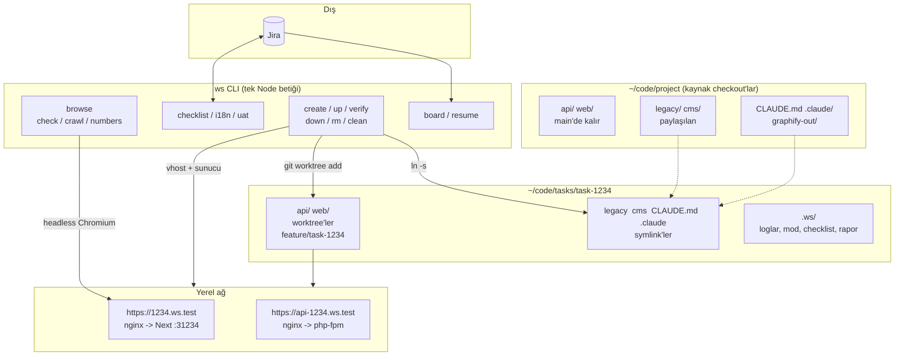
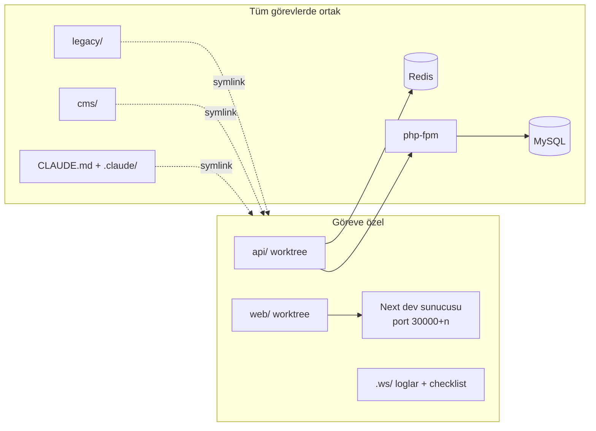

# 1. Mimari ve ilkeler

## Parça haritası

Claude Code her zaman `~/code/project` içinde açılır, görev klasörüne kendisi geçer ve bir insanın
çalıştıracağı `ws` komutlarının aynısını çalıştırır.

## İlkeler

| İlke | Uygulamada |
|---|---|
| Bir görev, bir alan | Görev kodu sadece `tasks/task-<n>/` altında düzenlenir. Kökteki `api/` ve `web/` main'de kalır. |
| Teşhis et, sor, sonra düzelt | Claude dosya:satır, sebep ve düzeltmeyi gösterir, sonra bekler. |
| Commit ve push'u insan yapar | Claude mesajı ve dosya listesini önerir, onay bekler. |
| Sayfayı oku, test yazma | Her değişiklik render edilmiş sayfanın ve API verisinin mantıksal kontrolüyle biter ([05](05-dogrulama-ve-uat-kapisi.md)). |
| Kanıtla kapat | Checklist maddesi sayfada görülenle kapanır. |
| Bağlamı baştan ver | Repo bilgisi rule dosyalarında, kod ilişkileri grafta; ikisine de grep'ten önce bakılır. |
| Kuralları hook'lar zorlar | Tipografi, slop ve önce graf kuralı sadece metin değil, hook. |
| Agent ve insan için tek araç | `ws` terminalde de Claude'un Bash aracında da aynı davranır; çıktısı kısa düz metin. |

## Paylaşılan ve göreve özel

| Kaynak | Kapsam | Sonuç |
|---|---|---|
| `api/`, `web/` | Göreve özel | Kendi branch'i ve sunucusu |
| `legacy/`, `cms/` | Paylaşılan | Değişiklik her görevde görünür; Claude düzenlemeden önce uyarır |
| Veritabanı, Redis, php-fpm | Paylaşılan | Migration veya cache temizliğinden önce açık görevler listelenir |
| `CLAUDE.md`, `.claude/` | Paylaşılan | Görev klasöründeki oturumlar aynı hook'ları ve agent'ları kullanır |

`legacy/` ve `cms/` worktree değil: nadiren değişiyorlar ve görev başına kurulumları pahalı
(WordPress, çok host'lu bir framework). Bu ödünleşimi kabul ettik ve uyarıyı kurala çevirdik.
