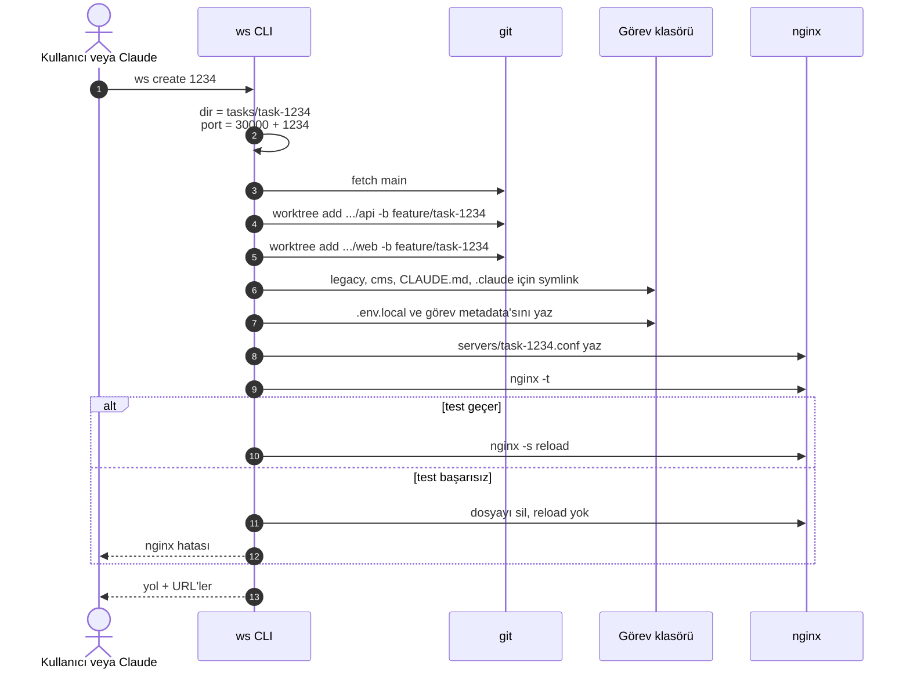
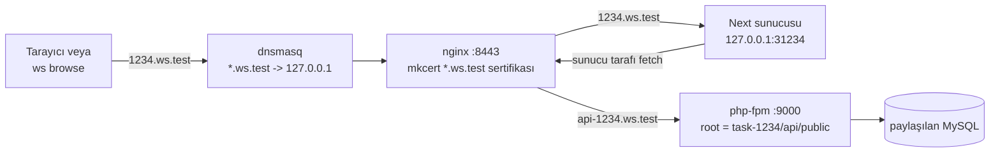
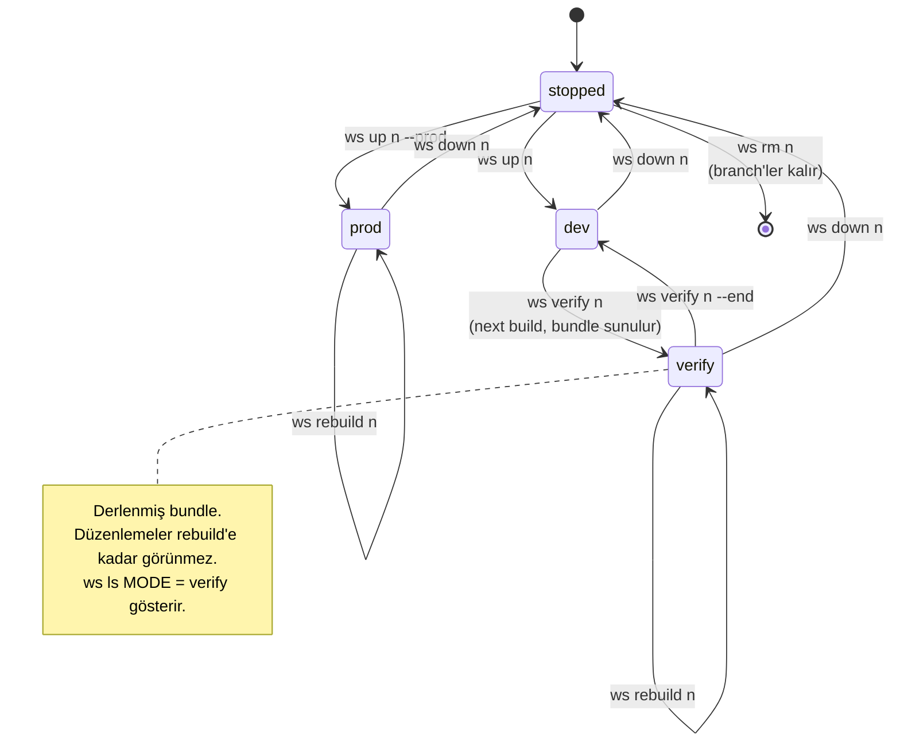
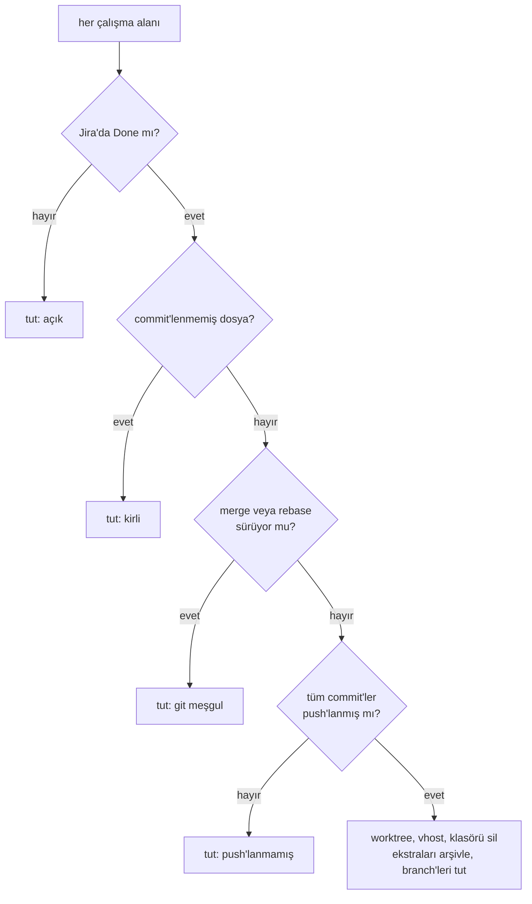
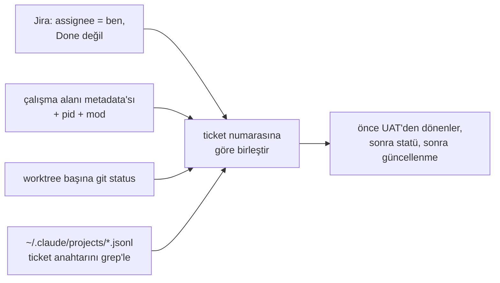

# 2. Görev çalışma alanları ve `ws` CLI

## Hedef

`ws create 1234` yaklaşık iki dakikada şunları verir:

- `api/` ve `web/` için `feature/task-1234` branch'leri ve worktree'ler,
- görev klasöründe env dosyaları,
- `https://1234.ws.test:8443` (frontend) ve `https://api-1234.ws.test:8443` (API),
- `ws up 1234` sonrası, sadece o göreve ait bir Next dev sunucusu.

Kaynak checkout'lar hiç değişmez. Beş görev yan yana çalışabilir.

## `ws create`

## Yönlendirme

| Parça | Nasıl | Not |
|---|---|---|
| Kod | Repo başına `git worktree add` | `node_modules` worktree başına; en yavaş adım ilk kurulum |
| Paylaşılan repolar | `legacy`, `cms`, `CLAUDE.md`, `.claude` için symlink | `.claude` olmazsa görev klasöründeki oturum hook'ları ve agent'ları kaybeder |
| Port | `30000 + görev numarası` | Çakışma yok, akılda tutulacak bir şey yok |
| DNS | dnsmasq `address=/ws.test/127.0.0.1` | Bir kez kurulur |
| HTTPS | `*.ws.test` için mkcert wildcard | Tarayıcılar https sayfadan http API'ye XHR'ı engeller; Node `NODE_EXTRA_CA_CERTS` ile güvenir |
| Yönlendirme | Görev başına bir nginx vhost | `nginx -t` başarısız olursa geri alınır |
| API | nginx -> paylaşılan php-fpm, root görev worktree'sinde | Süreç paylaşılan, kod göreve özel |
| Süreç | Detached Next sunucusu; pid ve mod `.ws/` altında | `.ws/server.log`, `.ws/build.log` |
| Bellek | Her `next dev`'e enjekte edilen Turbopack bellek sınırı | Çok görev açıkken makine kullanılabilir kalır |

Şablon: [templates/nginx/task-vhost.conf.example](../../templates/nginx/task-vhost.conf.example).

## Sunucu modları

`next dev` minify, statik üretim ve ISR adımlarını atlar; bu yüzden bir sayfa dev'de geçip release build'de
kırılabilir. Tüm modlar aynı URL'yi kullanır:

Dev saniyeler içinde açılır ve kaydedince yenilenir; build 1-3 dakika sürer ve push'tan önce bir kez kullanılır.
`verify`, `--end` ile dev'e dönen bir kontrol oturumudur; `prod` durdurulana kadar release build sunar.
`ws rebuild` hangi build modu çalışıyorsa onu yeniden derler.
Build'de source map'ler açık kalır.

## Komutlar

| Grup | Komutlar |
|---|---|
| Çalışma alanı | `setup`, `create`, `up`, `verify [--end]`, `rebuild`, `down`, `ls`, `rm`, `clean` |
| Jira | `config` (token işletim sistemi keychain'inde), `jira`, `board`, `resume`, `export` |
| Kalite | `checklist`, `i18n`, `uat` |
| Tarayıcı | `browse open/click/type/eval/shot/check/crawl/numbers` |

Tasarım kararları:

- Tek Node betiği, tarayıcı daemon'ı dışında npm bağımlılığı yok. Kurulum = symlink.
- Numara verilmezse görev branch adından (`feature/task-<n>`) çıkarılır.
- `setup` root gerektiren adımları çalıştırmak yerine yazdırır.
- `rm` branch'leri tutar, sonradan eklediğiniz dosyaları arşivler.
- `resume` iade edilen bir ticket'ı ve onunla ilgili eski bir oturumu seçtirir, yeni bir sekmede `claude --resume <id>` çalıştırır.

### `ws clean`

### `ws board`

Tek bir JSON; Claude "durum ne" sorusuna tek çağrıyla cevap verir:

## Uyarlarken

- Port tabanını ve TLD'yi ortam değişkeni yapın.
- Sadece sık değişen repoları worktree yapın.
- Env dosyalarını CLI yazsın; elle kopyalananlar ilk kırılan olur.
- Her görevin loglarını tek klasörde symlink'leyin (`tasks/.logs/`), Claude nereye bakacağını bilsin.
