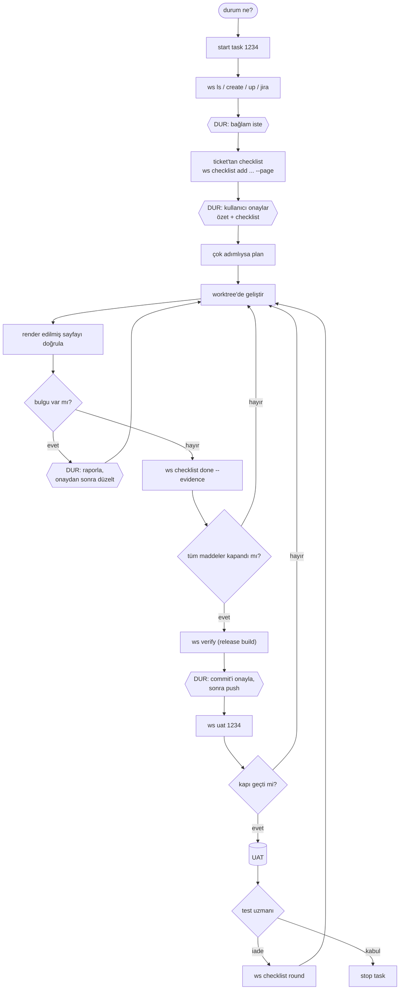
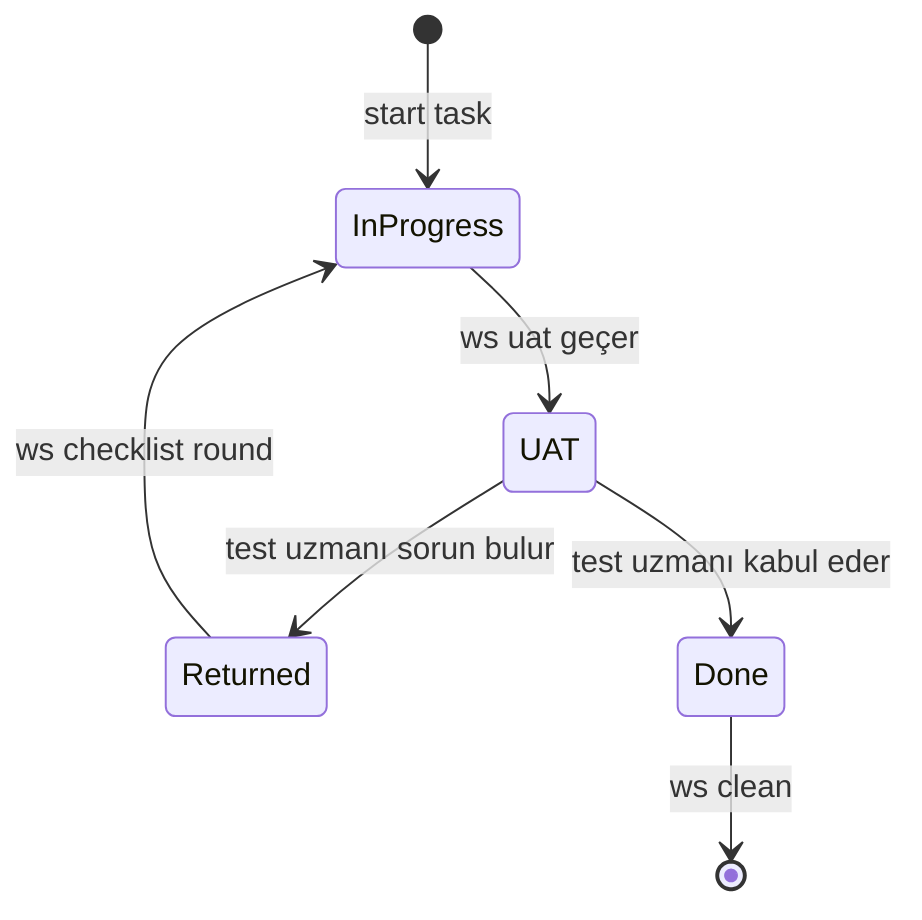
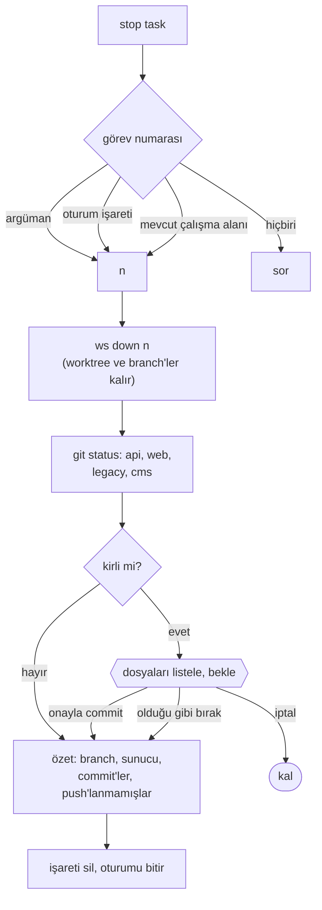

# 3. İş akışı

## Baştan sona bir ticket



Altıgenler, Claude'un bir insanı beklediği duraklar.



## "Durum ne?"

`status` skill'i `ws board --json` çalıştırır ve sırasıyla şunları listeler: UAT'den dönen ticket'lar, commit'lenmemiş iş,
açık kalmış sunucular, sonra diğer statüler sayı olarak. 30 ticket yerine üzerinde iş yapılabilecek beş satır.

## `start task 1234`

CLAUDE.md'deki tetikleyici ve `/start-task` aynı adımları çalıştırır:

1. Çakışmalar erken görünsün diye `ws ls`.
2. `ws create 1234 --yes`, `ws up 1234`; görev numarası oturum kimliğiyle kaydedilir.
3. Tüm okuma ve düzenlemeler görev klasörüne geçer.
4. `ws jira 1234`: ticket özeti ve URL'ler.
5. Claude ek bağlam ister ve **durur**.

Bu durak önemli: Slack yazışmaları, tablolar, ekran görüntüleri ve "şu sayfayı örnek al" gibi şeyler ticket'a nadiren girer.

## Checklist, koddan önce

Kontrol edilebilir her istek için bir madde, her biri bir sayfaya bağlı:

```bash
ws checklist 1234 add "Product table has a price filter" --page /products
```

Numaralı listeler ve "bir de..." cümleleri ayrı madde olur. Claude görevi 3-6 satırda özetler, açık soruları
listeler ve onay bekler. UAT iadelerinde en sık sebep atlanmış maddelerdi, bu yüzden en çok getiri bu adımda.

## Geliştirme

Küçük işler doğrudan yapılır. Çok adımlı işlerde superpowers kullanılır: brainstorm, plan, alt agent'larla uygulama,
sistematik debugging. Planlar gitignore'daki bir klasöre yazılır.

- Hata bulundu: önce teşhis, onaydan sonra düzeltme.
- Paylaşılan repo (`legacy/`, `cms/`): düzenlemeden önce uyar.
- Bozuk sayfa: tahmin etme, `.ws/server.log` ve `.ws/build.log` dosyalarını oku.

## Doğrulama

Her değişiklikten sonra `page-logic-verifier` (veya Claude) sayfayı `ws browse check/crawl/numbers` ile okur
ve raporlar. Maddeler kanıtla kapanır:

```bash
ws checklist 1234 done 1.3 --evidence "/tr/products: filter shows 12 price ranges, browse check clean"
```

## Teslim

1. `ws verify 1234`, değişen sayfaları kontrol et, `ws verify 1234 --end`.
2. Claude commit'i önerir; commit ve push ayrı ayrı onay ister.
3. `ws uat 1234` açık madde, push'lanmamış iş, eksik anahtar veya sayfa hatası varsa bloklar. Geçerse rapor yazar
   ve ticket'ı taşır. `--force` insanın kararıdır.

İade: `ws resume` eski oturumu yeniden açar; `ws checklist 1234 round` test uzmanının teslimden beri yazdığı
notları basar, her not bir madde olur, sonra kapıdan yeniden geçilir.

## `stop task`



Stash, reset veya discard asla yok.
