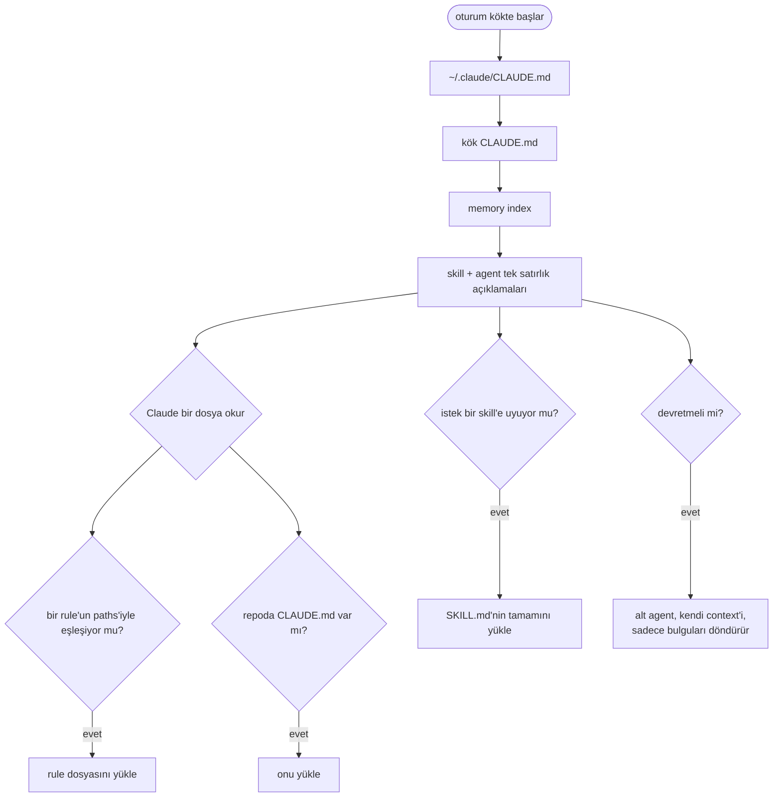
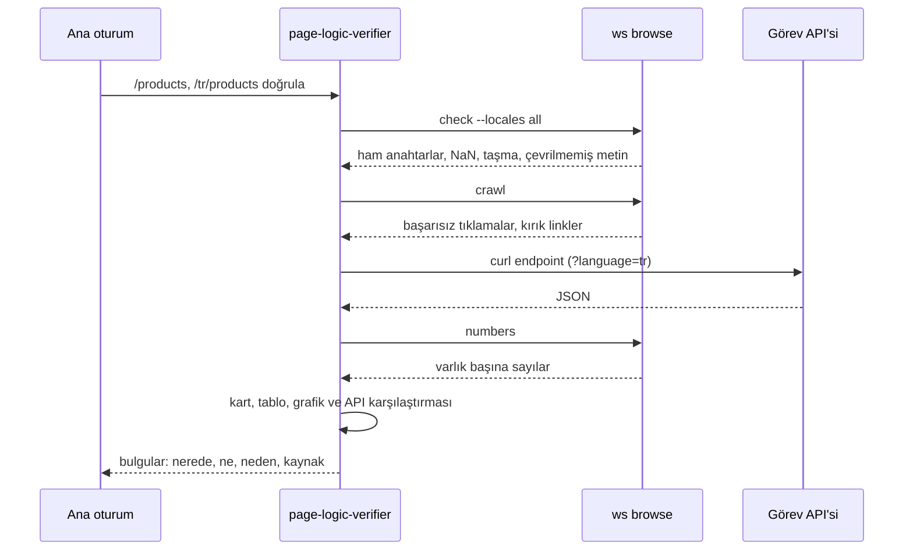
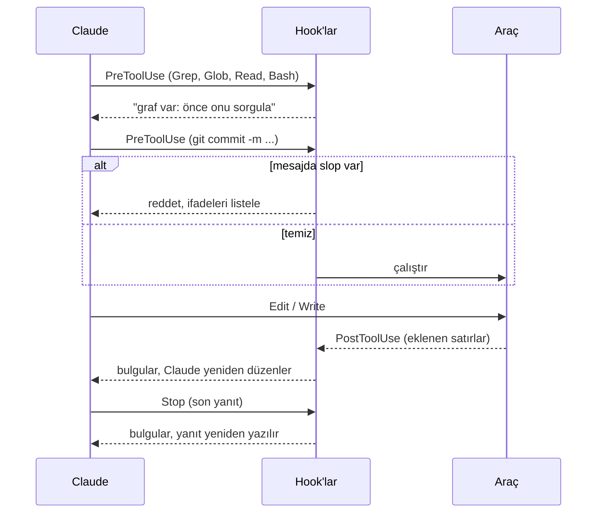

# 4. Claude Code yapılandırması

## Katmanlar

| Katman | Dosya | Ne zaman yüklenir | İçerik |
|---|---|---|---|
| Kullanıcı | `~/.claude/CLAUDE.md` | Her oturumda | Kişisel skill tetikleyicileri |
| Proje | `<root>/CLAUDE.md` | Kökte açılan oturumlarda | Repo haritası, yasaklar, süreçler, tipografi, doğrulama politikası |
| Repo | `web/CLAUDE.md` vb. | O repodaki bir dosyaya dokunulunca | Kısa repo kuralları, repoda commit'li |
| Rule | `.claude/rules/*.md` | `paths:` ile eşleşen bir dosya okununca | Klasör yapısı, DB, helper'lar, endpoint'ler, kod standartları |
| Komut | `.claude/commands/*.md` | `/command` | Adım adım akışlar |
| Agent | `.claude/agents/*.md` | Claude iş devredince | Kendi context'i olan bir uzman |
| Skill | `~/.claude/skills/*/SKILL.md` | Açıklaması isteğe uyunca | Tetiklenen bilgi paketi |
| Hook | `.claude/settings.json` | Araç çağrılarının etrafında, yanıt sonunda | Zorunlu kontroller |
| Memory | `~/.claude/projects/<project>/memory/` | Her oturumda (index) | Düzeltmelerden öğrenilen tercihler |



Pratik kural: kısa ve kesin olan CLAUDE.md'ye, uzun referans `rules/` altına. Repo referansını rule dosyalarına
taşıyınca frontend oturumları PHP standartlarını yüklemeyi bıraktı.

## Kök CLAUDE.md

Şablon: [templates/CLAUDE.md](../../templates/CLAUDE.md).

| Bölüm | Amaç |
|---|---|
| Codebase overview | Dört repo, rolleri, rule'ların yeri |
| Git | Kök bir repo değil; her zaman `git -C <repo>` |
| Typography | Em/en dash yok; slop listesine işaret |
| Verification: no tests | Sayfayı oku; skill'lerdeki TDD adımlarını geçersiz kılar |
| Never without confirmation | Bug fix, commit, push, tablo silme, altyapı değişikliği |
| Always safe | Arama, okuma, statik analiz, cache temizliği |
| Output | Raporlar, tek seferlik betikler ve AI planları için gitignore'daki klasörler |
| Processes | Çalışma alanları, `start task`, checklist ve UAT, `stop task` |
| Code graph | Grep'ten önce graf sorgusu |

Yasakları liste halinde yazın ve her kurala tek satırlık bir gerekçe verin; Claude sebebini bilince kenar durumlarda daha iyi karar veriyor.

## Yol bazlı rule'lar

```markdown
---
paths:
  - "web/**"
---
# web/ - Next.js frontend
```

Repo başına bir tane, bir de ortak güvenlik incelemesi dosyası. Örnek: [templates/.claude/rules/web.md](../../templates/.claude/rules/web.md).

Bizim kurulumumuzda, oturum kökü dışındaki dosyalarda (bir görev worktree'si) rule'lar her zaman otomatik yüklenmedi. CLAUDE.md, Claude'a
oradaki ilk düzenlemesinden önce eşleşen rule'u tam yoluyla okumasını söyler.

## Komutlar, agent, skill

| Ad | Tür | İş |
|---|---|---|
| `/start-task <n>` | Komut | Çalışma alanı, ticket, bağlam için durma, checklist |
| `/stop-task [n]` | Komut | Sunucuyu durdur, commit'lenmemiş işi işaretle, özet, çıkış |
| `page-logic-verifier` | Agent (salt okuma, daha küçük model) | Sayfayı ve API verisini okur, tutarsızlıkları raporlar |
| `status` | Skill | `ws board` ile "durum ne" |

Agent sayfa dökümlerini, ekran görüntülerini ve JSON'u ana oturumun dışında tutar; geriye sadece bulgular döner:



Skill `description` alanına göre seçilir; oraya insanların gerçekte yazdığı ifadeleri, kullandıkları her dilde koyun.

## Hook'lar



Şablon: [templates/.claude/settings.json](../../templates/.claude/settings.json). Yollar `$CLAUDE_PROJECT_DIR` kullanır.

## Memory

- Yerleşik memory: dosya başına bir bilgi, her oturumda yüklenen bir index. Örnekler: "onay olmadan asla commit atma",
  "test yok, sayfayı oku", "fazladan satırı bulunduğu sırayı uzatan kartı işaretle". Sadece koddan anlaşılamayanı saklayın.
- remember plugin'i: oturum günlükleri; başlangıçta son günlerin özeti enjekte edilir.

## İzinler ve auto mode

| Dosya | Kapsam | İçerik |
|---|---|---|
| `.claude/settings.json` | Proje, paylaşılan | Salt okunur komutlar ve hook'lar |
| `.claude/settings.local.json` | Kişisel | Onaylar burada birikir, token'lar dahil. Asla paylaşmayın. |
| `~/.claude/settings.json` | Kullanıcı | Okuma izinleri, plugin'ler, status line, `autoMode` |

Auto mode'da `autoMode.environment` sınıflandırıcıya hangi alan adlarının güvenilir olduğunu, neyin production sayıldığını
ve gizli bilgilerin nerede durduğunu söyler; `soft_deny` force push'u ve production config yazımını yeniden onaya düşürür.

Paylaşılan allowlist'leri dar tutun. Sınırsız `Read` ile kısıtsız `curl` GET birlikte olunca bir prompt injection
bir gizli bilgiyi okuyup kimse istemeden bir URL içinde dışarı gönderebilir.
