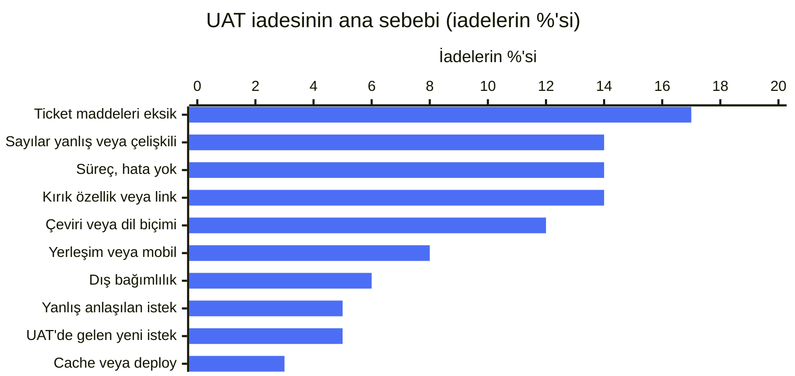
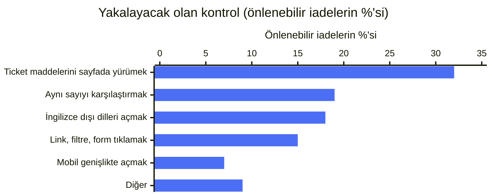
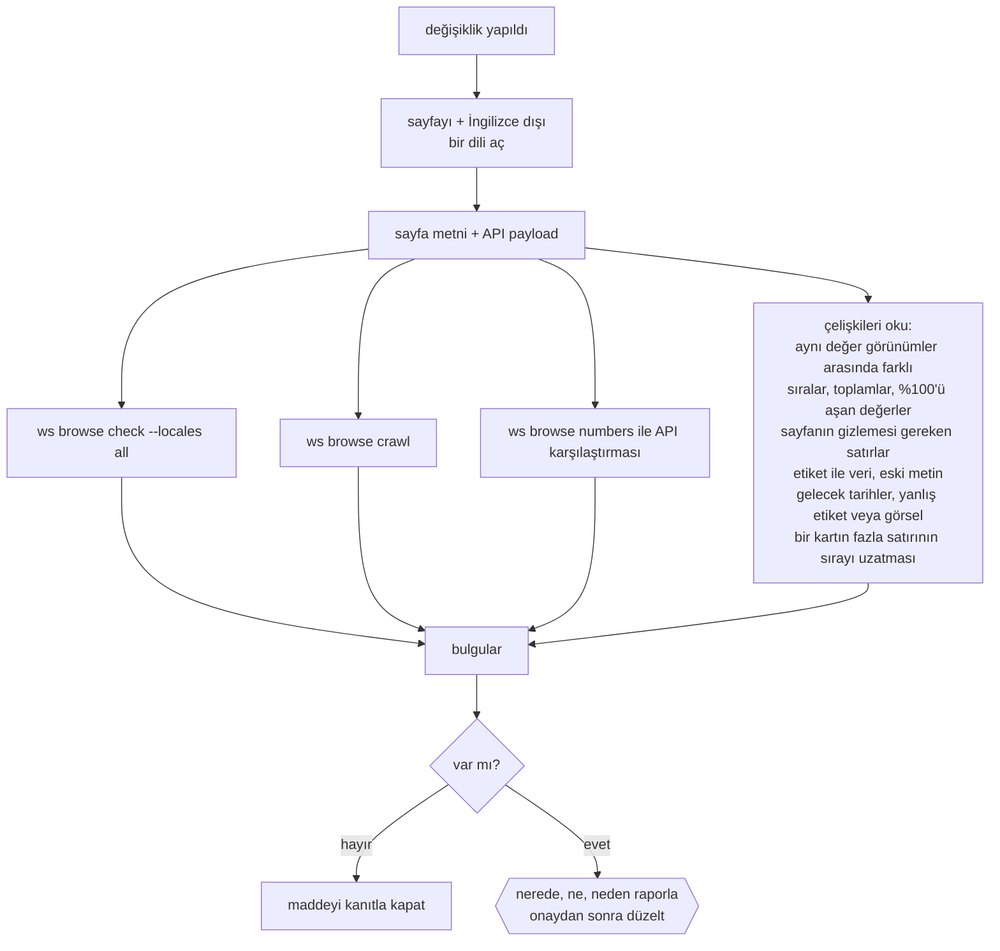
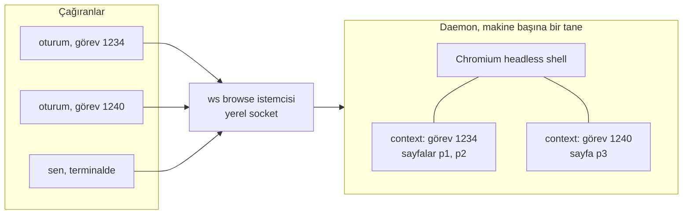
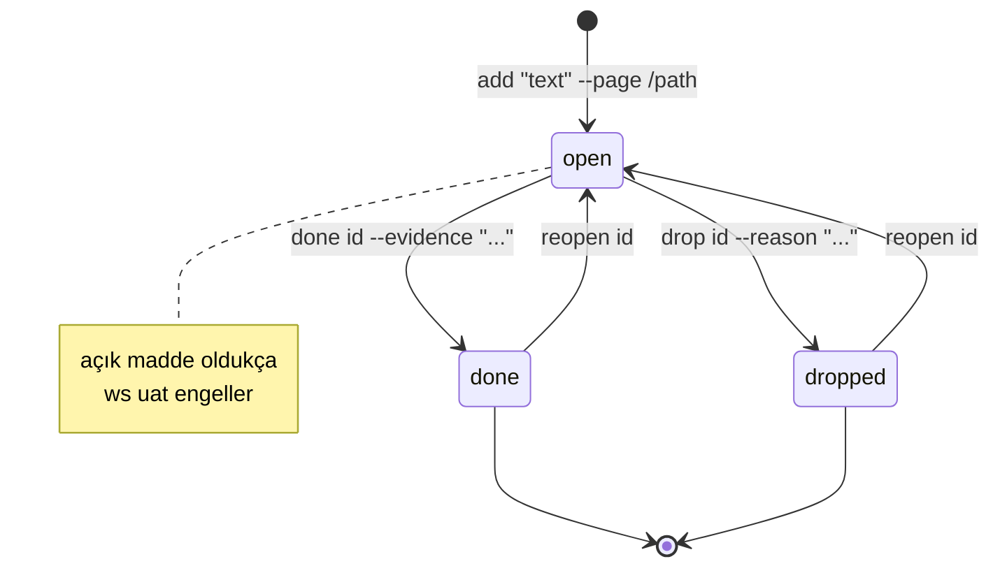
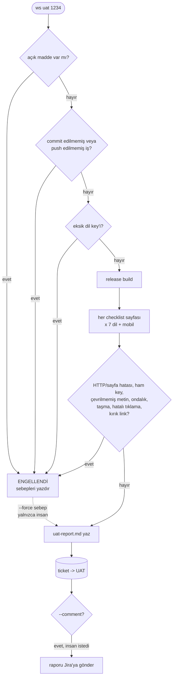

# 5. Doğrulama ve UAT kapısı

## Neden test değil, sayfa

Jira'dan yaklaşık altı aylık UAT iadesini çektik (statü değişiklikleri ve her iadenin etrafındaki yorumlar),
üç ayrı model çalıştırmasıyla sabit bir sebep listesine göre etiketledik ve bir kısmını elle kontrol ettik.
UAT'ye teslim edilen işlerin yaklaşık üçte biri en az bir kez geri dönmüştü.

Yaklaşık %70'i önlenebilirdi, ama birim testle değil. Her birini yakalayacak olan kontrol:

İlk beşi %90'ın üzerini kapsıyor. Bu yüzden bu repolarda test yok; her değişiklik bu beş kontrolle bitiyor
ve kontrolleri araçlar yapıyor. CLAUDE.md, bunun "önce başarısız bir test yaz" adımlarının önüne geçtiğini söylüyor.

## Doğrulama turu

Bunu [page-logic-verifier](../../templates/.claude/agents/page-logic-verifier.md) agent'ı yürütüyor.

## `ws browse`: tüm agent'lar için tek tarayıcı

Playwright MCP her oturum için ayrı bir tarayıcı açıyor ve uzun çıktı veriyordu; paralel beş görev makinenin
belleğini bitirdi. Yerine tek bir headless Chromium daemon'ı koyduk (`playwright-core`, yaklaşık 1.100 satır):

- Her görev için bir context; bir oturum başka bir görevin sayfalarına dokunamaz.
- Metin çıktısı: açılışta `[eN]` referanslı bir taslak, tıklamada yalnızca fark.
- Görseller, fontlar ve analytics varsayılan olarak engelli.
- Boşta kalan sayfalar 10 dakika sonra, daemon 15 dakika sonra kapanır.

| Komut | Yakaladığı |
|---|---|
| `check <url> --locales all` | Her dilde: ham key'ler, `NaN`/`undefined`/`null`, kırık görseller, tekrarlanan satırlar, h1 sayısı, `lang` uyuşmazlığı, console/HTTP hataları, hâlâ İngilizce kalan metin, virgüllü dillerde `.` ondalık, 390px taşma (ekran görüntüsüyle) |
| `crawl <url>` | Her buton, sekme, select ve checkbox tek tek tıklanır; hatalar ve 4xx/5xx linkler listelenir |
| `numbers <url>` | Tablo ve kartlardan varlık başına sayılar, API ile karşılaştırmak için |

`ws i18n` tüm dil dosyalarında key eşliğini kontrol eder.

## Checklist

Kanıt demek URL, görünen şey ve hangi kontrolün temiz döndüğü demek. Tek başına "Bitti" sayılmaz.

## `ws uat <n>`

UAT'ye tek giriş yolu:

Jira'ya göndermek ve `--force` insanın kararı; CLAUDE.md, Claude'un ikisini de kendi başına yapmasını yasaklıyor.

Sırada: kapıyla geçen bir aydan sonra iadeleri aynı yöntemle yeniden etiketleyip önlenebilir payın düşüp düşmediğine bakmak.
