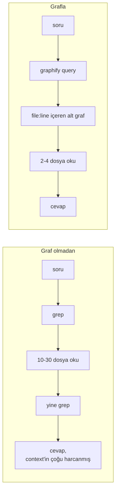
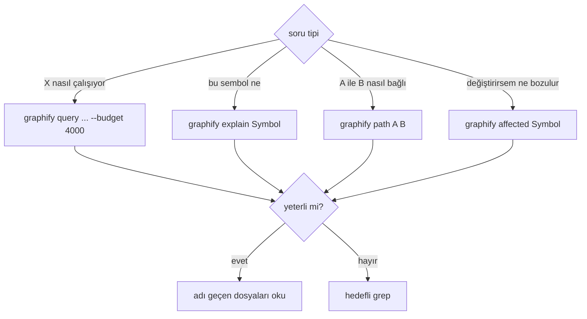
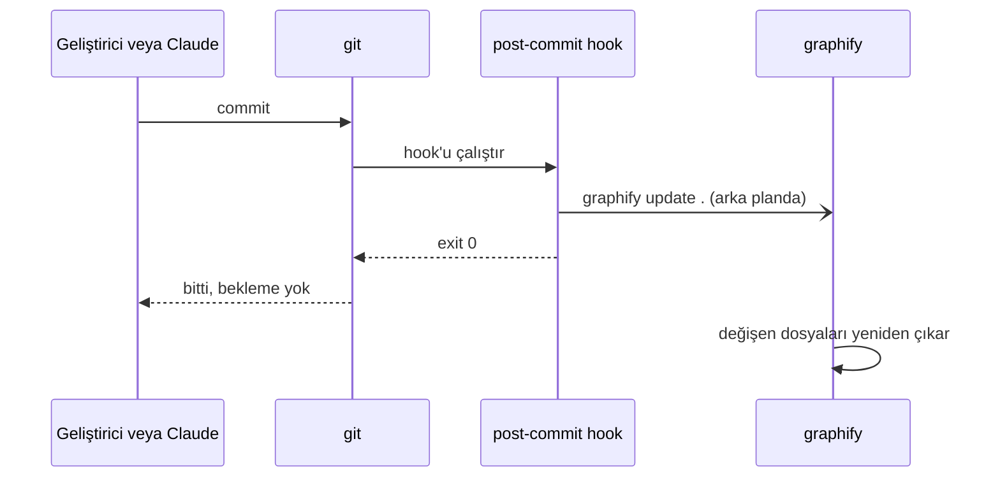

# 6. Kod grafı (graphify)

## Neden

Dört repo, PHP ve TypeScript, repolar arası çağrılar (frontend servisi -> API route -> controller -> tablo).
Claude her soru için grep yapıp onlarca dosya okuyordu. [graphify](https://pypi.org/project/graphifyy/) AST'den
bir graf kuruyor (burada yaklaşık 9 bin node, 25 bin edge) ve Claude yalnızca ilgili alt grafı çekiyor.



## Kurulum

```bash
uv tool install graphifyy
graphify install --platform claude        # /graphify skill
cd ~/code/project && graphify update .    # AST only, no LLM cost
```

`.graphifyignore` WordPress'i, vendor kodunu, görselleri ve minify edilmiş dosyaları dışarıda tutuyor. Minify
edilmiş dosyalar grafı tek harfli sembollerle dolduruyordu, ilk onlar çıkarıldı.

## Sorgular



- Varsayılan 2000 token'lık bütçe mimari cevapları kısa kesiyor; 4000 kullanın.
- `trim` ve `json_decode` gibi builtin'ler geniş sorguları boğuyor; `explain` ve `path` odaklı kalıyor.
- Kaynak dosyası olmayan node'lar builtin'dir.

## Claude'u yönlendirmek

- CLAUDE.md: kod soruları için önce graf.
- Bir hook (`graphify hook-guard`), `Grep`, `Glob`, `Read` veya `Bash` içinde bir aramadan önce Claude'a hatırlatıyor.
- Graf komutları onay istemiyor.

## Güncel tutmak



Şablon: [templates/git-hooks/post-commit](../../templates/git-hooks/post-commit).
