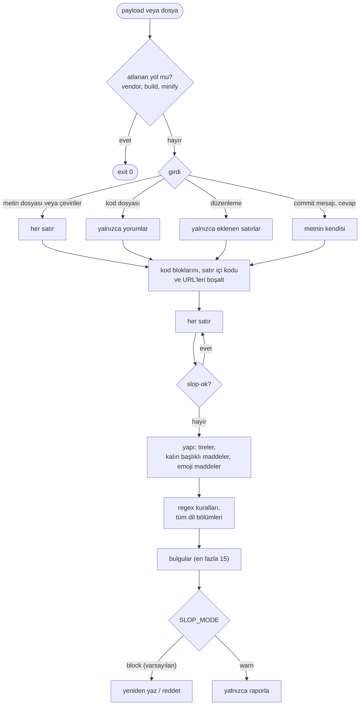

# 7. Slop kontrolü

## Sorun

Claude'un yazdığı metin commit'lere, PR'lara, yorumlara, arayüz metnine ve 7 dildeki çevirilere giriyor. Tanıdık
yapay zeka kalıpları (`delve`, `seamless`, `leverage`, "not only X but also Y", em dash'ler, kalın başlıklı maddeler)  <!-- slop-ok -->
metni kimsenin okumadığını gösteriyor. CLAUDE.md'deki yasaklı kelime listesi uzun oturumlarda tutunamadı.

## Çözüm

Bağımlılığı olmayan bir Python script'i ve bir kural dosyası ([templates/.claude/slop/](../../templates/.claude/slop/)),
üç hook tarafından çalıştırılıyor:

| Hook | Kontrol ettiği | Sonuç |
|---|---|---|
| PostToolUse `Edit\|Write\|MultiEdit` | Yalnızca eklenen satırlar. Kodda yorumlar; `.md`, `.txt`, `.html` ve çeviri dosyalarında tüm metin | Claude yeniden düzenler |
| PreToolUse `Bash` | `git commit`, `gh pr` mesajları | Komut reddedilir |
| Stop | Son cevap | Cevap yeniden yazılır |



Çalışma anındaki LLM çıktısı (makine çevirisi, içerik üreten plugin'ler) kapsam dışında.

## Kurallar

```
[en]
leverag(e|es|ed|ing) => "use"
not only\b.{0,60}\bbut also => say both things plainly
```

`<regex> => <hint>`, büyük/küçük harf duyarsız. Kelime sınırı yalnızca başa ekleniyor, böylece ekler yine
eşleşiyor (Türkçe ve Almanca için işe yarıyor). Bölümler: `[en] [tr] [de] [es] [fr] [it] [pt]`. İpuçları eş
anlamlı bir kelime değil, sade bir yeniden yazım istiyor. Bir kalıbı iki kez gördükten sonra kural ekleyin;
sürekli yanlış alarm veriyorsa kaldırın.

## Kullanım

```bash
python3 .claude/slop/slop_check.py draft.md        # exit 1 = findings
pbpaste | python3 .claude/slop/slop_check.py -      # stdin
python3 .claude/slop/slop_check.py --json file.md
```

Doğrulama agent'ı render edilmiş sayfa metnini de bundan geçiriyor. Yanlış alarm: satıra `slop-ok` ekleyin.
Yalnızca uyarı için: `SLOP_MODE=warn`.
