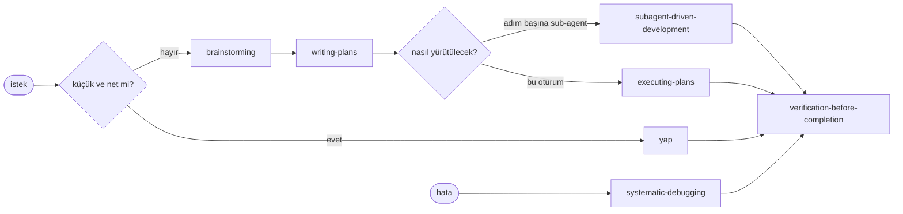
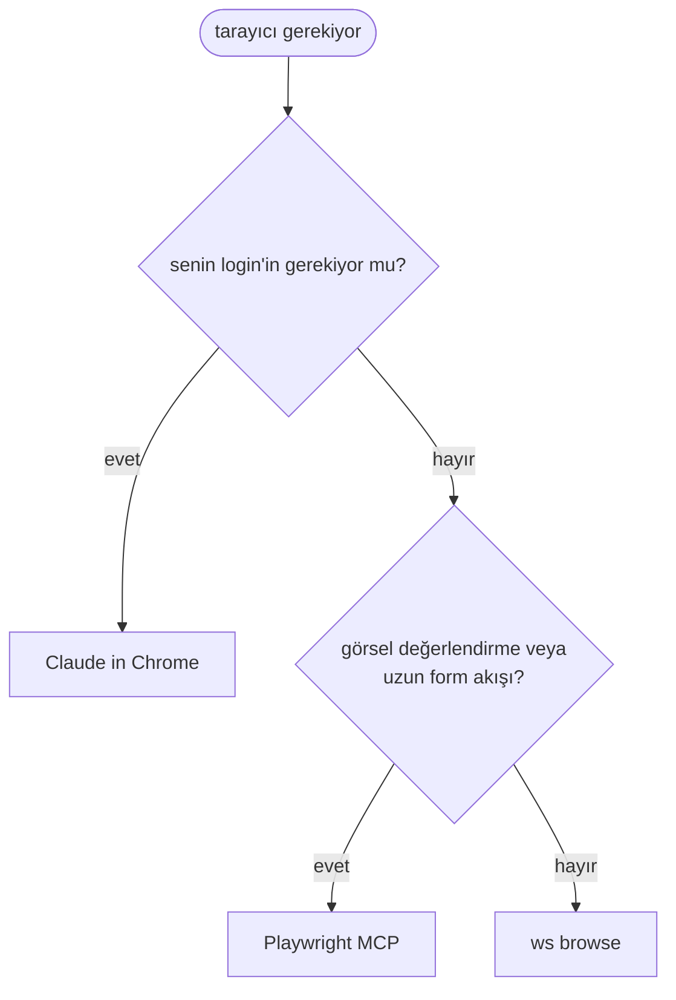

# 8. Plugin'ler, skill'ler ve MCP sunucuları

## Plugin'ler

Resmi `claude-plugins-official` marketplace'inden.

| Plugin | Kullanım |
|---|---|
| superpowers | Süreç skill'leri: beyin fırtınası, planlar, sistematik debug, "bitti" demeden önce kanıt, code review |
| remember | Oturum kayıtları; başlangıçta son günlerin özeti |
| atlassian | Confluence araması, toplantı notlarından Jira görevleri, sprint özetleri |
| playwright | Görsel kontrol veya login gerektiren tarayıcı kontrolleri |

## Bu projede superpowers



CLAUDE.md iki varsayılanı geçersiz kılıyor: TDD adımları (yerlerine sayfa kontrolleri geliyor) ve planların
commit edilmesi (gitignore'daki bir klasöre gidiyorlar).

## Yerleşik komutlar

| Komut | Kullanım |
|---|---|
| `/code-review`, `/simplify`, `/security-review` | İnceleme, temizlik, güvenlik |
| `/fewer-permission-prompts` | Geçmiş oturumlardaki salt okunur komutlardan allowlist |
| `/hooks`, `/agents`, `/plugin` | Kurulumu kontrol etmek |

## Tarayıcılar ve MCP



Bir editör MCP sunucusu, "bu dosya" dediğinizde Claude'un aktif dosyayı, seçimi ve açık dosyaları okumasını sağlıyor.

## Durum satırı

En alttaki satırda klasör, model ve context kullanımı; böylece yeni bir oturuma ne zaman geçeceğinizi görürsünüz:

```sh
#!/bin/sh
input=$(cat)
dir=$(basename "$(echo "$input" | jq -r '.workspace.current_dir // .cwd')")
model=$(echo "$input" | jq -r '.model.display_name // empty')
used=$(echo "$input" | jq -r '.context_window.used_percentage // empty')
printf '%s | %s | ctx: %s%%' "$dir" "$model" "$(printf '%.0f' "${used:-0}")"
```
