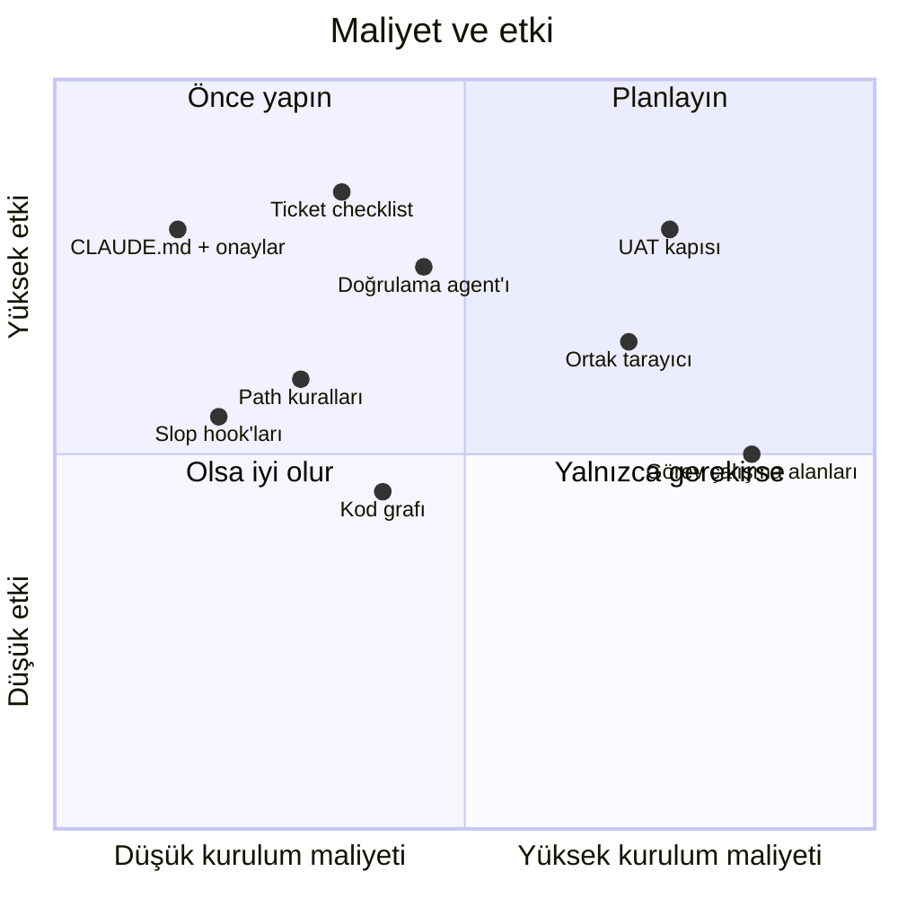
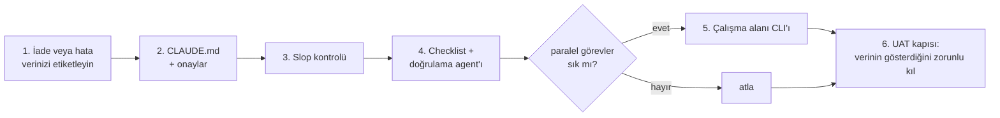

# 9. Dersler

## İşe yarayanlar

| Ders | Ayrıntı |
|---|---|
| Araçtan önce veri | "Daha çok test" gerektiğini sanıyorduk. Etiketlenmiş iadeler atlanan maddeleri, çelişen sayıları ve eksik çevirileri gösterdi. |
| Metin yerine hook | CLAUDE.md'deki yasaklar uzun oturumlarda unutuluyor; hook'lar unutulmuyor. |
| Agent ve insan için tek CLI | Kısa çıktı, Bash'ten çağrılıyor. Bakımı yapılacak tek şey, insanlar da çalıştırabiliyor. |
| Duraklar | Context sorusu, checklist onayı, düzeltme onayı. En pahalıya patlayan, erken yazılan kod. |
| Kanıt | "Hangi URL, ne gördün"; checklist ve kapı bunu zorunlu tutuyor. |
| Korunan context | Doğrulama bir sub-agent'ta, referans bilgisi path kurallarında, kod soruları grafta. |
| Tahmin edilebilir adresler | Port ve host görev numarasından türüyor; Claude URL'yi kendisi çıkarabiliyor. |
| Tek çağrıda durum | Jira, çalışma alanları, git ve geçmiş oturumlar tek bir JSON'da. |

## Tuzaklar

| Belirti | Sebep | Çözüm |
|---|---|---|
| Düzenlemeler görünmüyor | Sunucu build modunda kalmış | `ws ls` içindeki MODE sütunu; doğrulamayı her zaman bitirin |
| Görev oturumunda hook yok | Görev klasöründe `.claude` yok | Symlink verin |
| Kural dosyası yüklenmedi | Dosya oturum kökünün dışında | CLAUDE.md'de "önce kuralı oku" |
| Bir görev diğerini bozdu | Ortak repo veya DB | Ortak düzenlemelerden önce uyarın; migration'dan önce görevleri listeleyin |
| Kaynak checkout'ta düzenleme | Hangi görevde olduğu unutuldu | Oturum işareti + açık kural |
| Yavaş makine | Çok sayıda dev sunucusu | Bellek sınırı, `ws down`, `ws clean` |
| Allowlist'te token | Kişisel izinler komutları olduğu gibi saklıyor | Asla paylaşmayın; token'lar ortam değişkenlerinden gelsin |

## Nereden başlamalı

Bizim beş kontrolümüz bizim iadelerimize uyuyor. Önce sizinkileri etiketleyin, araçları o seçsin.
