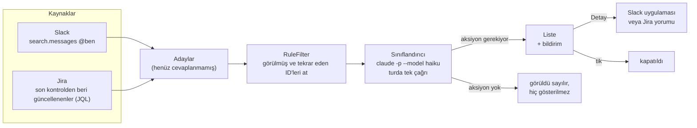
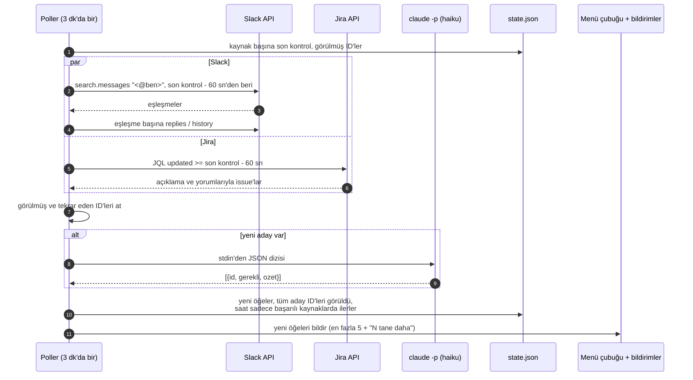
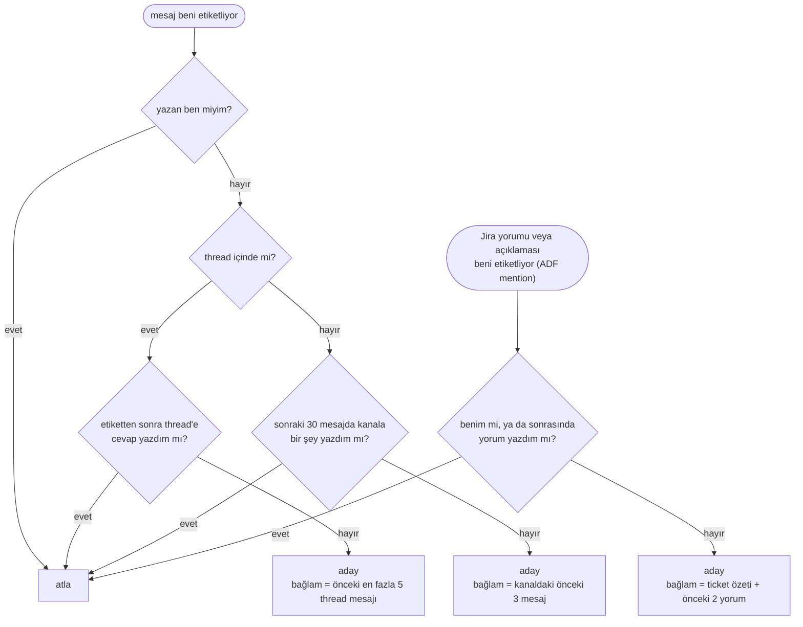
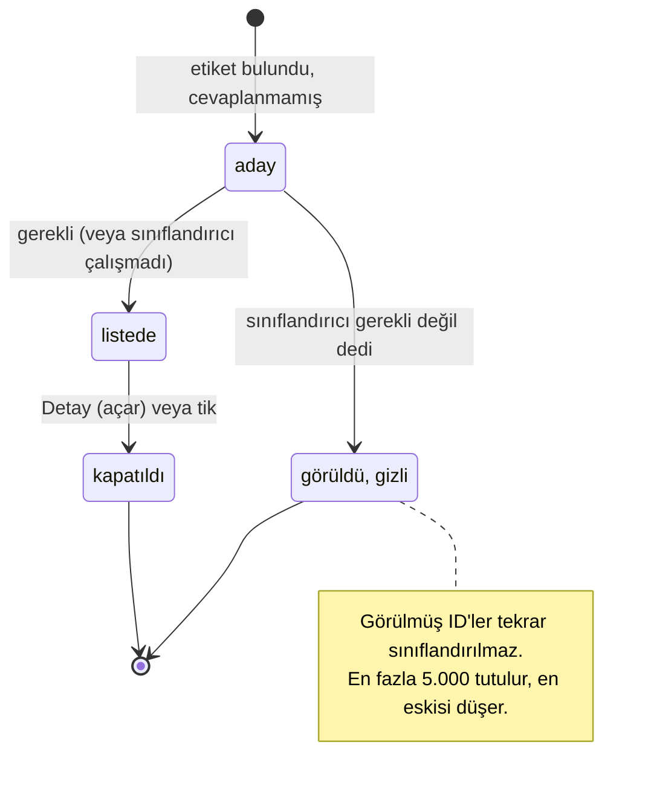

# 10. Bildirim kutusu

## Sorun

İstekler Slack ve Jira etiketleri olarak geliyor; teşekkürler, bilgilendirmeler ve başkasına yazılmış
mesajlarla karışık. Kalabalık bir kanaldaki "bakar mısın?" kolayca kaçıyor, Jira'nın kendi bildirimleri de
ne istendiğini söylemiyor. `ws board` ticket'ları kapsıyor; bu, senden bir şey isteyen insanları kapsıyor.

## Ne yapar

Küçük bir macOS menü çubuğu uygulaması (Swift, yaklaşık 1.050 satır, bağımlılık yok). 3 dakikada bir:

1. Slack ve Jira'da seni etiketleyen ve henüz cevaplamadığın mesajları toplar,
2. tek bir çağrıyla Claude'a hangilerinin senden aksiyon beklediğini sorar ve her biri için tek satırlık özet alır,
3. sadece onları masaüstü bildirimi ve liste olarak gösterir; **Detay**, mesajı Slack'te veya Jira yorumunu
   tarayıcıda açar.



## Bir tur



## "Henüz cevaplanmamış" ne demek



Bağlam önemli: sadece "bakar mısın?" yazan bir DM, önceki mesajlar da birlikte gittiği için anlamlı bir özet alıyor.

## Sınıflandırıcı

Turda tek `claude -p` çağrısı, sadece yeni aday varsa:

```bash
claude -p --model haiku --output-format json \
  --system-prompt "<rules below>" \
  --tools "" --strict-mcp-config --setting-sources "" \
  --no-session-persistence --settings '{"alwaysThinkingEnabled":false}'
```

Sistem istemi kısaca: *gerekli* = sana soru soruluyor, senden iş, inceleme, onay veya cevap bekleniyor, ya da
senin sorumlu olduğun bir şey kırılmış. Teşekkür, bilgilendirme, kutlama ve başkasına verilen işler gerekli
değil. *ozet* = tek cümle, en fazla 90 karakter, ikinci tekil şahıs ("X, şunun neden ... bakmanı istiyor");
sayılar, birimler ve isimler aynen korunur; çıktı sadece JSON dizisi.

| Seçim | Neden |
|---|---|
| Bütün grup için tek çağrı | Mesaj başına değil, tur başına bir süreç ve bir kota kullanımı |
| En küçük model, thinking kapalı | Thinking açıkken 7 öğe yaklaşık 80 sn sürdü; kapalıyken aynı çıktı yaklaşık 7 sn |
| `--tools ""`, MCP yok, ayar yok | Mesaj metni güvenilmeyen girdi; araç olmadığı için kötü niyetli bir mesaj en fazla kendi kararını veya özetini değiştirebilir |
| "Sayıları aynen koru" kuralı | İlk denemelerden biri "4+ gece"yi "4+ saat" yaptı |
| Önceki mesajlar bağlam olarak | Kısa DM'lerde ("bakar mısın?") özetlenecek içerik yoktu |
| Sert zaman aşımı, 3 sn sonra SIGKILL | `claude` bir kez SIGTERM'ü yok saydı ve tur dakikalarca asılı kaldı |

**Hata sessiz değil, görünür.** Çağrı başarısız olursa, zaman aşımına uğrarsa veya bozuk JSON dönerse tüm
adaylar gerekli sayılır, özet olarak ham mesajın ilk 100 karakteri gösterilir ve üstte bir uyarı satırı çıkar.
Model bir öğeyi atlarsa o öğe ham haliyle gösterilir. Model bozuldu diye hiçbir şey kaybolmaz.

## Öğenin yaşam döngüsü



## Diğer tasarım seçimleri

| Seçim | Neden |
|---|---|
| Kimlik bilgileri Keychain'den `/usr/bin/security` ile | Uygulama ad-hoc imzalı; imza her build'de değişiyor ve Keychain API her seferinde onay isteyip turu bloklıyordu |
| Jira kimliği `ws` CLI ile ortak | Tek `ws config`, iki araç |
| Saat sadece başarılı kaynaklarda ilerler | Slack kesintisi Slack mesajlarını kaybettirmez; sonraki tur eski zamandan tekrar sorar |
| Her sorguda 60 sn örtüşme | Arama indekslemesi birkaç saniye gecikiyor; tekrar eden ID'ler zaten atılıyor |
| Durum tek bir JSON dosyasında | Liste, görülmüş ID'ler ve son kontrol zamanları yeniden başlatmada korunur; pencere buradan anında açılır |
| `--dump [--hours N]` modu | Duruma dokunmadan tek tur çalıştırır, her adayı kararıyla yazdırır; sınıflandırıcıyı ham mesajlarla karşılaştırmak için |
| Xcode'suz, düz `swiftc` build betiği | Sadece Command Line Tools ile derleniyor |

## Doğrulama

Rehberin geri kalanıyla aynı kural: test yok, çıktıyı kontrol et. Dump modu bir zaman aralığındaki her adayı
kararıyla yan yana koyar; her mesaj ya listededir ya da dışarıda olmasının belirtilmiş bir sebebi vardır (kendi
mesajın, cevaplanmış, gerekli değil). Sonra: bir kanal mesajında, bir DM'de, bir thread'de ve bir Jira yorumunda
Detay denenir; aynı öğe iki kez bildirilmez; boştaki bellek ve CPU `ps` ile ölçülür.

## Bilinen sınırlar

| Sınır | Etkisi | Olası çözüm |
|---|---|---|
| İkili karar, en yeni üstte | Aciliyete göre sıralama yok; bir kesinti uyarısı ile bir inceleme isteği aynı görünür | Modelden öncelik iste (örneğin acil / bugün / sonra) ve ona göre sırala |
| Kanalda "cevaplandı" kontrolü sonraki 30 mesajda senin herhangi bir mesajına bakıyor | Kalabalık kanalda ilgisiz bir mesajın gerçek bir isteği gizler | Sadece yazarı etiketleyen veya mesajı alıntılayan cevapları say |
| Cevaplanan öğeler listede kalıyor | Slack'te doğrudan cevap verirsen öğe kapatılana kadar durur | Açık öğeleri her turda cevap için tekrar kontrol et |
| Jira JQL zamanı Mac'in saat dilimiyle yazılıyor | Jira bunu profildeki saat dilimiyle okur; farklıysa pencere kayar ve etiketler kaçabilir | Örtüşmeyi büyüt veya `/myself`'teki saat dilimine çevir |
| Eşleşme başına Slack çağrısı, rate limit yönetimi yok | Büyük bir ilk pencere 429 alabilir; başarısız kaynak aynı zamandan tekrar dener ve sürekli başarısız olabilir | 429'da bekle, ilk pencereyi sınırla |
| Jira araması tek sayfa okuyor (50 issue) | Uzun bir ilk pencerede issue kaçabilir | Sayfalama ekle |
| "Gerekli değil" kararı kesin | Yanlış değerlendirilen mesaj bir daha gelmez | "Gizlenenler" görünümü tut, ya da aynı thread'e yeni mesaj gelirse tekrar göster |
| Mesaj metni Claude API'ye gidiyor | Şirket içi yazışma makineden çıkıyor | Yaygınlaştırmadan önce veri politikanla karşılaştır |

Araç bilerek tek kullanıcılı: kullanıcı, workspace ve Jira host'u sabit.
