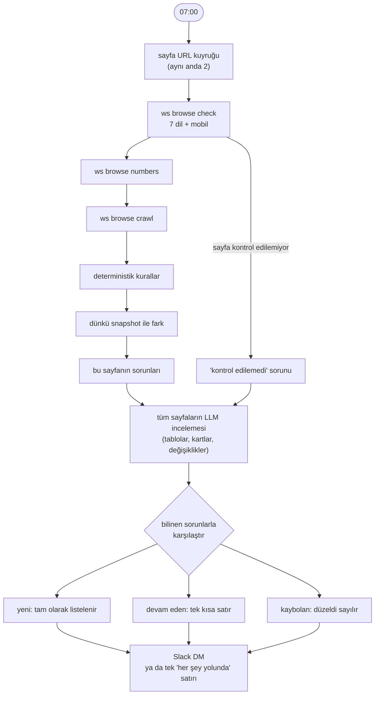
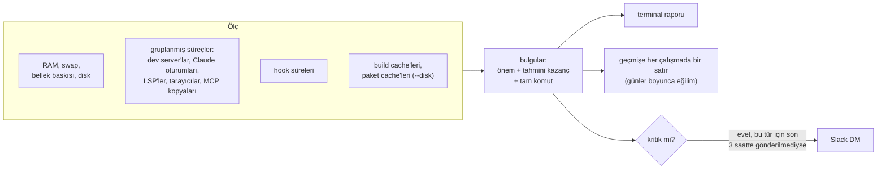
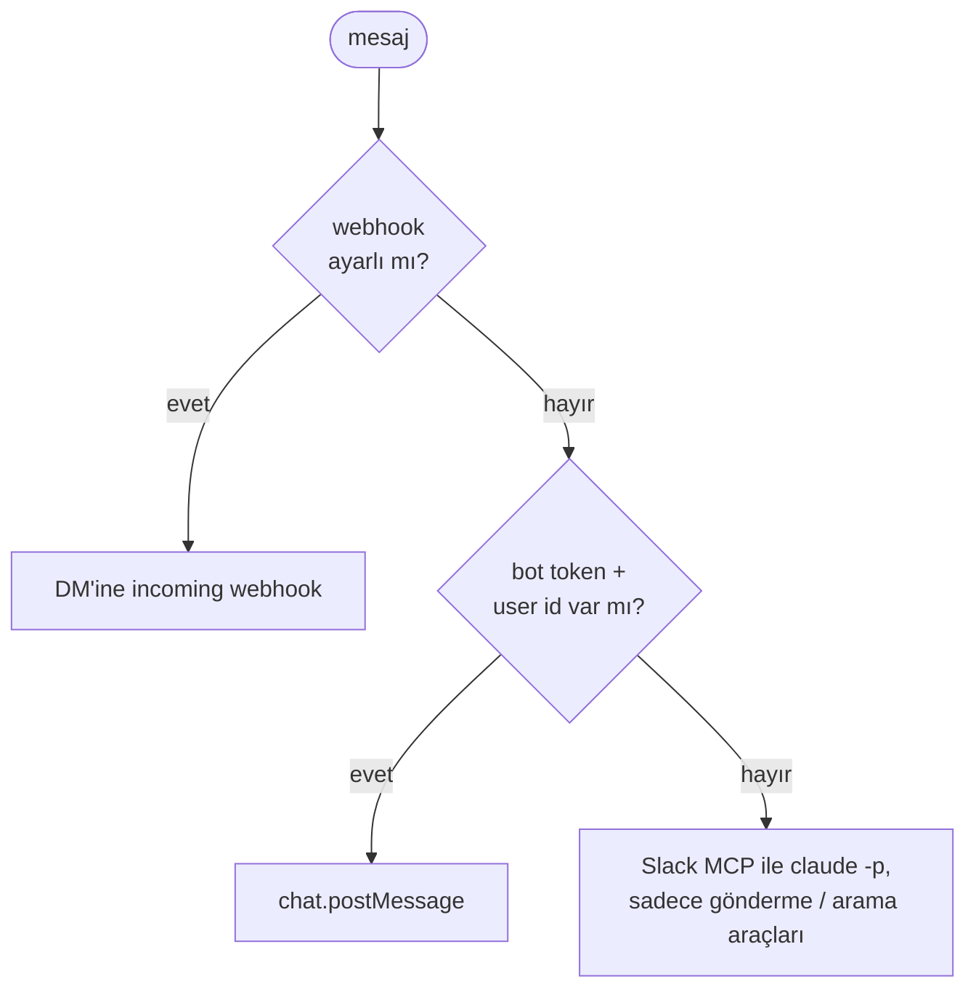

# 11. Arka plan otomasyonu: watch, maintain, doctor, notify

## Neden

UAT kapısı bir sayfayı bir kez, teslimde kontrol eder. Sayfalar sonra da bozulur: bir veri aktarımı, başka
bir ticket, bir çeviri çalışması. Beş dev server, birkaç Claude oturumu ve headless bir tarayıcı çalıştıran
bir makine de nedenini söylemeden yavaşlar. Dört `ws` komutu kendi kendine çalışır ve kişisel bir Slack
DM'ine raporlar.

| Komut | Ne zaman | Görev |
|---|---|---|
| `ws watch` | Her gün, 07:00 | Test sitesinde sahibi olduğun sayfaların mantık kontrolü, dünle karşılaştırmalı |
| `ws maintain` | Her gün, 06:00 | Temizlik: biten çalışma alanları, boştaki sunucular, loglar, cache'ler, eski transcript'ler |
| `ws doctor` | 5 dakikada bir (örnekleme), istendiğinde (rapor) | Makineyi neyin yavaşlattığına dair sadece okuyan rapor, her bulgu için bir komutla |
| `ws notify` | Diğer üçü kullanır | Hepsi için tek Slack DM kanalı |

Üç iş de macOS LaunchAgent'ı (`ws <cmd> service start|status|stop`); yeniden başlatmalardan sağ çıkar ve
sunucu gerektirmez.

```mermaid
gantt
    title Sıradan bir sabah
    dateFormat HH:mm
    axisFormat %H:%M
    section maintain
    temizlik, ardından özet DM        :m, 06:00, 50m
    section watch
    6 sayfa x 7 dil + mobil     :w, 07:00, 40m
    LLM incelemesi + DM                  :after w, 10m
    section doctor
    5 dk'da bir örnek, kritikte DM :d, 06:00, 180m
```

## `ws watch`: günlük sayfa mantık kontrolü

Her katmanın yakaladıkları:

| Katman | Yakaladığı |
|---|---|
| `browse check` | Ham çeviri key'leri, `NaN`/`undefined`/`null`, çevrilmemiş metin, yanlış ondalık ayırıcı, `lang` uyuşmazlığı, bozuk görseller, tekrarlanan satırlar, HTTP ve sayfa hataları, mobil taşma |
| `browse crawl` | Hata fırlatan tıklamalar, 4xx/5xx linkler |
| Kurallar | Skor sütununa göre büyük ölçüde sıralı bir tabloda sırası bozuk bir satır; 100'ü aşan yüzdeler; negatif fiyat veya süreler; tablonun ilk satırını göstermeyen bir "en iyi model" kartı; o varlığın satırında olmayan bir kart sayısı |
| Fark | Dün 200 dönüp bugün hata veren bir dil; yeni console hataları; %20'den fazla değişen satır sayısı; ilk 10'dan kaybolan ya da 5 sıradan fazla kayan bir varlık; %30'dan fazla oynayan bir skor |
| LLM incelemesi | Kuralların göremedikleri: yanlış şirketin altındaki bir varlık, doğru olamayacak bir fiyat, iki farklı adla görünen aynı şey, güncellemeden çok veri hatasına benzeyen bir değişiklik |

DM'i kısa tutan bilinen sorunlar listesidir: bir sorun ilk gün tam olarak yazılır, sonra kaybolana kadar
tek bir "devam ediyor" satırı olarak görünür.

İnceleme prompt'u "sadece dikkatli bir okurun işaretleyeceği gerçek mantık sorunlarını" ve "emin olmadığın
hiçbir şeyi yazmamasını" ister, JSON dizisi olarak. Önce kurallar çalışır, model sadece onlara ekleme yapar;
böylece model kesintisi raporu değil, sadece ek katmanı götürür.

## `ws maintain`: günlük temizlik

Her adım ne yaptığını loglar ve diğerlerini asla durdurmaz:

1. `ws clean --yes`: biten çalışma alanlarını kaldır (elle yapılandaki güvenlik kurallarıyla: bitmiş
   durum, temiz, her şey push'lanmış; branch'ler kalır).
2. 8 saattir log çıktısı olmayan dev server'ları durdur.
3. 24 saattir açık olan dev server'ları yeniden başlat (Turbopack belleği büyüyor).
4. Claude oturumu kapanmış headless tarayıcıları öldür.
5. 50 MB'ı aşan görev loglarını son 5 MB'larına kırp.
6. Kaynak checkout'larda `git worktree prune`.
7. Paket yöneticisi cache temizliği.
8. 30 gündür dokunulmamış Claude transcript'lerini gzip'le.
9. Kullanıcı cache temizliği (sudo yok).
10. Dünkü doctor raporunu kaydet.

Ardından tek bildirim ve tek DM: öncesi ve sonrasıyla boş disk ve swap.

## `ws doctor`: makineyi ne yavaşlatıyor

Sadece okur. Ölçer, açıklar ve çalıştırılacak komutu yazar; hiçbir şeyi kendisi durdurmaz.

Arka planda bir örnekleyici onu 5 dakikada bir çalıştırır; `ws doctor report` bir günün örneklerini zaman
çizelgesine çevirir. CLAUDE.md, işler yavaşladığında Claude'un onu çalıştırmasına izin verir, ama kill ya da
stop önerilerine sana sormadan uymasına izin vermez.

## `ws notify`: hepsi için tek kanal

Ayarlar tek bir `chmod 600` dosyasında durur. `ws notify test` bir deneme mesajı gönderir. Uzun raporlar
Slack kabul etsin diye kesilir.

## İlk haftadan dersler

| Ne oldu | Neden | Çözüm |
|---|---|---|
| Sabah raporu "88 yeni" ile "85 düzeldi" arasında gidip geldi | Kontrol edilemeyen bir sayfanın o gün hiç sorunu yoktu, bu yüzden bilinen sorunları düzeldi sayıldı, sonra yeni olarak geri geldi | Kontrol edilemeyen sayfanın bilinen sorunlarını olduğu gibi devret |
| Bazı sabahlar her sayfa "kontrol edilemedi" | Büyük ihtimalle yük: tarayıcı daemon'ı başlarken temizlik 07:00'de hâlâ sürüyordu (bir cache temizliği bir saatlik timeout'una takıldı) | Sayfa kontrolünü temizlik bitince başlat, yavaş adımlara üst sınır koy |
| İnceleme modeli varsayılan araçlarla çalıştı | Sayfa metni dışarıdan gelen girdi; bildirim kutusu ve tahmin araçları modellerini zaten `--tools ""` ile çalıştırıyor | Her arka plan `claude -p` çağrısını araçsız çalıştır, birine ihtiyaç varsa sadece ona izin ver |

Buradan çıkardığımız genel kural: bir arka plan işi kendi kapsamını da raporlar. "6 sayfa kontrol edildi, 0
sorun" ile "6 sayfadan 0'ı kontrol edildi" farklı mesajlardır ve aynı görünmemelidir.
