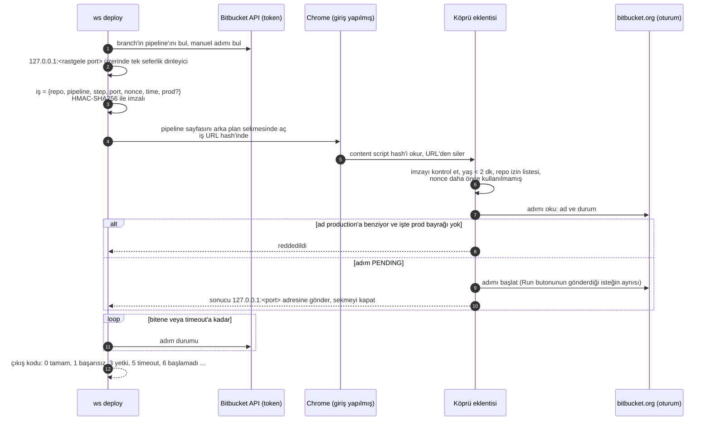
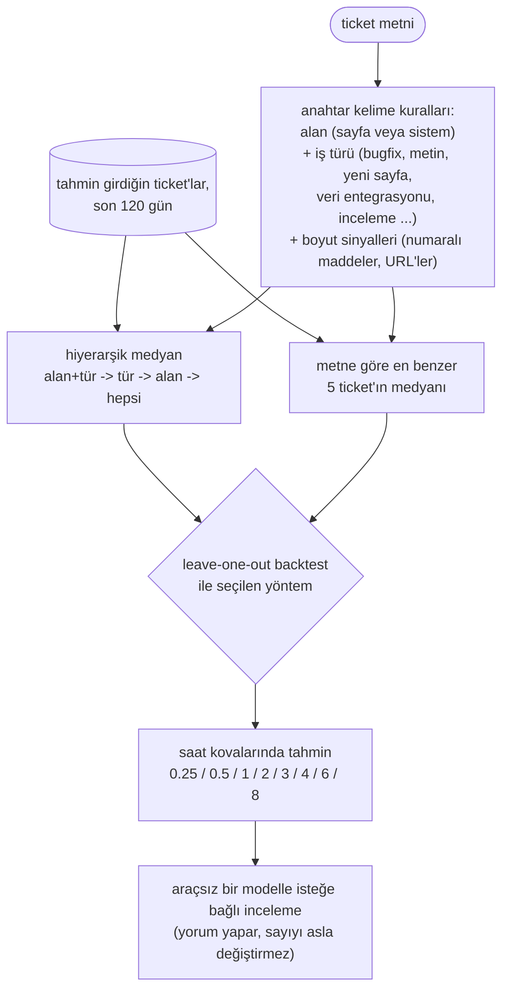
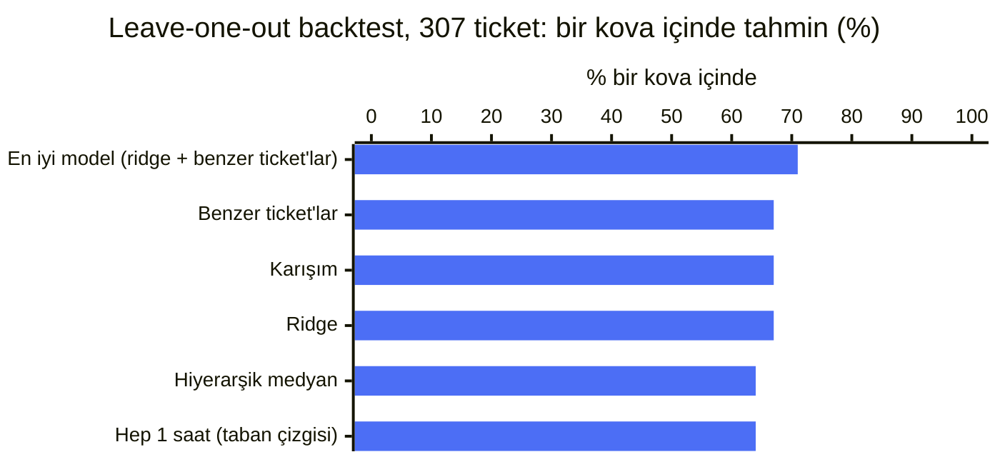

# 12. Terminalden deploy, geçmişten tahmin

Bir ticket'ın iki ucundaki boşlukları kapatan iki küçük `ws` komutu: iş başlamadan önce `ws estimate`,
gösterilmeye hazır olduğunda `ws deploy`.

## `ws deploy`: manuel bir pipeline adımında "Run"a basmak

Feature, test ve production deploy'ları Bitbucket Pipelines'ta manuel adımlar. Bunlara basmak, tarayıcıyı
açıp branch'in pipeline'ını bulmak ve Run'a tıklamak demekti, her repo için.

```bash
ws deploy 1234                      # feature branch, frontend + API "Feature Deploy" steps
ws deploy 1234 --repo=api           # one repo
ws deploy test --repo=web,api       # test branch
ws deploy production ... --prod     # production: --prod required, then a confirmation prompt
ws deploy 1234 --status --json      # just read the state
```

Pipeline'ları okumak ve bir adımı beklemek API token ile çalışır. Manuel bir adımı başlatmak çalışmaz:
Bitbucket o endpoint'te API token'larını reddeder. Bu yüzden başlatma, zaten giriş yapmış olduğun tarayıcı
oturumunu kullanan küçük bir Chrome eklentisinden geçer.



Güvenlik tasarımı:

| Risk | Önlem |
|---|---|
| Hazırlanmış bir link deploy başlatır | İşler, `ws deploy bridge-setup` ile oluşturulan bir secret ile HMAC imzalı (Keychain + eklenti ayarı, `chmod 600`) |
| Sayfa yenileme ya da kopyalanan URL bir işi tekrar oynatır | İş URL'den hemen silinir; nonce saklanır, tek kullanımlık; 2 dakikada süresi dolar |
| Başka bir repo için iş ya da production adımı | Eklentide repo izin listesi; adım adı orada yeniden okunur, imzalı iş `prod` demiyorsa production'a benzeyen her şey reddedilir |
| URL güvenilmeyen girdiden oluşturulur | Eklenti Bitbucket URL'ini sadece doğrulanmış alanlardan kurar |
| Yanlışlıkla production | `--prod` zorunlu, ardından `--yes` yoksa bir onay sorusu gelir |
| Başlatma isteği hata döner ama adım başlamıştır | CLI başlatma cevabına güvenmez; adım durumunu API üzerinden doğrular |

Kopyalamadan önce bilinmesi gereken iki şey:

- Başlatma isteği, Bitbucket'ın kendi arayüzünün iç bir endpoint'e gönderdiği istektir, public API değil.
  Haber vermeden değişebilir. Değiştiğinde CLI "could not start" ile hata verir ve Run'a elle basarsın.
- Claude'un Bash aracının terminali yok, bu yüzden production onay sorusu çıkamaz ve CLI `--yes` ister.
  Araçta bir agent'ın bunu eklemesini engelleyen hiçbir şey yok. Production deploy'larını CLAUDE.md'deki
  "açık onay olmadan asla" listesine ve `autoMode.soft_deny` içine koy.

## `ws estimate`: bir ticket'ı senin yapacağın gibi tahmin etmek

Tahminler Jira'da saat olarak tutuluyor. Araç, son 120 günde tahmin girdiğin kendi ticket'larından öğrenir.



`ws estimate tree` alan -> tür -> medyan saat haritasını yazar; `ws estimate backtest` her yöntemi, geçmiş
her ticket'ı sırayla gizleyip kalanlardan tahmin ederek ölçer.

### Ne kadar iyi



| Yöntem | Tam kova | Bir kova içinde | Tipik hata |
|---|---|---|---|
| En iyi model | %30 | %71 | yaklaşık 2x |
| Hep "1 saat" demek | %27 | %64 | |

En iyi yöntem basit taban çizgisini tam isabette 3 puan, bir kova içinde 7 puan geçiyor; tipik hata yaklaşık
2x. Dürüst sonuç bu, backtest'i araçta tutmamızın nedeni de bu: bir sağlama ("benzer ticket'lar yaklaşık bu
kadar sürdü"), kehanet değil. Alana göre bir kova içinde olma oranı yaklaşık %40 ile %89 arasında değişiyor;
backtest bunu alan bazında yazar, böylece hangi tür ticket'larda ona güvenebileceğini bilirsin.
